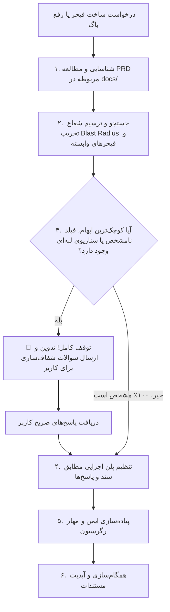

# Spec-Driven Development (SDD) & Regression Guard Skill

This skill enforces a rigorous, specification-first workflow for any feature implementation, enhancement, or bug fix.
It ensures that product design documents (PRDs) and architecture specs are always consulted first, dependent features are protected from collateral damage, and no assumptions are made without user verification.

---

## 🚫 Red Flags & Anti-Rationalization (STOP Rules)

If any of the following thoughts occur, **STOP IMMEDIATELY**. You are rationalizing shortcuts that lead to bugs, architectural drift, and regressions:

| ❌ Rationalization / Red Flag | 🛡️ Reality & Hard Rule |
|---|---|
| *"This is just a tiny bug or one-line fix, no need to check docs."* | **STOP.** Small fixes in auth, dates, or slots often trigger cascading regressions. You must check the relevant PRD first. |
| *"The prompt didn't specify X, but this default makes complete sense."* | **STOP.** Zero unilateral assumptions. You are forbidden from guessing defaults, schemas, or behaviors. Ask the user! |
| *"I already remember this feature from earlier in the chat."* | **STOP.** Code and specs evolve. Re-verify the active PRD and status documents before planning or modifying code. |
| *"Changing this endpoint or prop won't affect other components."* | **STOP.** Prove it! You must run a grep/search across both `front-end` and `backend_core` to verify all call sites. |
| *"I'll write the code first and ask questions if something fails."* | **STOP.** Pre-Implementation Stop Gate. Never write code before all ambiguous requirements are clarified by the user. |
| *"I can just dump this entire new feature/modal into the existing file."* | **STOP.** Anti-Bloat Rule! Create new dedicated modular files (components, hooks, utils) instead of swelling an existing file. |

---

## 🧩 اصل توسعه ماژولار و تفکیک فایل‌ها (Modularity & Anti-Bloat Principle)

هنگام ساخت فیچرهای جدید یا توسعه فیچرهای موجود، **اکیداً از انباشتن تمام لاجیک، کامپوننت‌ها و استیت‌ها درون یک فایل واحد خودداری کنید**. برای حفظ خوانایی، تست‌پذیری و جلوگیری از به وجود آمدن فایل‌های غول‌پیکر (God Files):

1. **تفکیک کامپوننت‌های فرعی (Sub-components Extraction):**
   - کارت‌ها، ردیف‌های جداول، دیالوگ‌ها و فرم‌های فرعی را در فایل‌های جداگانه در پوشه کامپوننت‌های مرتبط ایجاد کنید (مانند جداسازی کارت‌های شیفت، سلول‌های جدول، یا دکمه‌های اسلات).
2. **انتقال لاجیک به هوک‌های اختصاصی (Custom Hooks):**
   - منطق‌های پیچیده استیت، شمارنده‌ها، فرم‌ها یا سناریوهای تعاملی را به هوک‌های مجزا در `src/hooks/` منتقل نمایید.
3. **تفکیک سرویس‌های ارتباطی و توابع کمکی (Services & Utils):**
   - تمامی ارتباطات شبکه و درخواست‌های Axios باید در فایل‌های سرویس در `src/api/` یا `src/services/` قرار گیرند و از نوشتن کوئری‌های خام درون کامپوننت‌ها اجتناب شود.
   - تبدیلات تاریخ، اعتبارسنجی‌ها و قالب‌بندی‌ها باید در فایل‌های کمکی مجزا در `src/utils/` نوشته شوند.
4. **سقف بهینه حجم فایل (File Size Guardrail):**
   - فایل‌های کامپوننت یا ماژول‌ها نباید بی‌دلیل متورم شوند (ترجیحاً کمتر از ۲۰۰ تا ۳۰۰ خط). به محض مشاهده رشد بی‌رویه فایل، بخش‌های مستقل را در فایل جدید بسازید.

---

## 🛑 Pre-Implementation Stop Gate (Non-Negotiable)

> [!CAUTION]
> **قانون آهنین:** تا زمانی که مستندات خوانده نشده و به کلیه سوالات ابهام‌پذیر توسط کاربر پاسخ داده نشده باشد، تغییر یا ایجاد حتی یک خط کد در پروژه اکیداً ممنوع است.

---

## 🧭 Documentation Routing Map

Before proposing any change, you MUST navigate directly to the appropriate documentation:

### ۱. مستندات فرانت‌اند (Frontend PRDs)
- **فهرست و ماتریس اصلی:** [`docs/features/frontend/README.md`](file:///e:/GitHub%20Repo/kamelion/docs/features/frontend/README.md)
- **لایوت و ناوبری:** [`docs/features/frontend/01-layout-navigation/prd-layout-and-navigation.md`](file:///e:/GitHub%20Repo/kamelion/docs/features/frontend/01-layout-navigation/prd-layout-and-navigation.md)
- **احراز هویت بیمار (OTP):** [`docs/features/frontend/02-authentication/prd-patient-auth-otp.md`](file:///e:/GitHub%20Repo/kamelion/docs/features/frontend/02-authentication/prd-patient-auth-otp.md)
- **ورود و گارد ادمین:** [`docs/features/frontend/02-authentication/prd-admin-auth-guard.md`](file:///e:/GitHub%20Repo/kamelion/docs/features/frontend/02-authentication/prd-admin-auth-guard.md)
- **رزرو نوبت آنلاین:** [`docs/features/frontend/03-booking-and-calendar/prd-patient-appointment-booking.md`](file:///e:/GitHub%20Repo/kamelion/docs/features/frontend/03-booking-and-calendar/prd-patient-appointment-booking.md)
- **تقویم و اسلات‌ها:** [`docs/features/frontend/03-booking-and-calendar/prd-available-slots-calendar.md`](file:///e:/GitHub%20Repo/kamelion/docs/features/frontend/03-booking-and-calendar/prd-available-slots-calendar.md)
- **صفحه اصلی و لندینگ:** [`docs/features/frontend/04-public-content/prd-landing-home-page.md`](file:///e:/GitHub%20Repo/kamelion/docs/features/frontend/04-public-content/prd-landing-home-page.md)
- **خدمات پزشکی:** [`docs/features/frontend/04-public-content/prd-medical-services.md`](file:///e:/GitHub%20Repo/kamelion/docs/features/frontend/04-public-content/prd-medical-services.md)
- **بیوگرافی پزشک:** [`docs/features/frontend/04-public-content/prd-doctor-biography.md`](file:///e:/GitHub%20Repo/kamelion/docs/features/frontend/04-public-content/prd-doctor-biography.md)
- **سوالات متداول و مقالات:** [`docs/features/frontend/04-public-content/prd-faq-and-resources.md`](file:///e:/GitHub%20Repo/kamelion/docs/features/frontend/04-public-content/prd-faq-and-resources.md)
- **گالری ویدیو:** [`docs/features/frontend/04-public-content/prd-clinical-video-gallery.md`](file:///e:/GitHub%20Repo/kamelion/docs/features/frontend/04-public-content/prd-clinical-video-gallery.md)
- **تریاژ هوشمند AI:** [`docs/features/frontend/05-clinical-triage-ai/prd-ai-smart-triage.md`](file:///e:/GitHub%20Repo/kamelion/docs/features/frontend/05-clinical-triage-ai/prd-ai-smart-triage.md)
- **نظرات مراجعین:** [`docs/features/frontend/06-patient-engagement/prd-patient-reviews.md`](file:///e:/GitHub%20Repo/kamelion/docs/features/frontend/06-patient-engagement/prd-patient-reviews.md)
- **شیفت‌های هفتگی ادمین:** [`docs/features/frontend/07-admin-operations/prd-admin-weekly-availability.md`](file:///e:/GitHub%20Repo/kamelion/docs/features/frontend/07-admin-operations/prd-admin-weekly-availability.md)
- **استثنائات و تعطیلات:** [`docs/features/frontend/07-admin-operations/prd-admin-date-exceptions.md`](file:///e:/GitHub%20Repo/kamelion/docs/features/frontend/07-admin-operations/prd-admin-date-exceptions.md)
- **کارتابل نوبت‌های ادمین:** [`docs/features/frontend/07-admin-operations/prd-admin-appointments-management.md`](file:///e:/GitHub%20Repo/kamelion/docs/features/frontend/07-admin-operations/prd-admin-appointments-management.md)
- **پرونده بالینی بیماران:** [`docs/features/frontend/07-admin-operations/prd-admin-patient-dossiers.md`](file:///e:/GitHub%20Repo/kamelion/docs/features/frontend/07-admin-operations/prd-admin-patient-dossiers.md)
- **نظارت بر نظرات مراجعین:** [`docs/features/frontend/07-admin-operations/prd-admin-reviews-moderation.md`](file:///e:/GitHub%20Repo/kamelion/docs/features/frontend/07-admin-operations/prd-admin-reviews-moderation.md)
- **مدیریت ویدیوهای CMS:** [`docs/features/frontend/07-admin-operations/prd-admin-video-cms.md`](file:///e:/GitHub%20Repo/kamelion/docs/features/frontend/07-admin-operations/prd-admin-video-cms.md)
- **داشبورد آمار و گزارشات:** [`docs/features/frontend/07-admin-operations/prd-admin-dashboard-analytics.md`](file:///e:/GitHub%20Repo/kamelion/docs/features/frontend/07-admin-operations/prd-admin-dashboard-analytics.md)
- **شخصی‌ساز تم و رنگ:** [`docs/features/frontend/07-admin-operations/prd-admin-theme-customizer.md`](file:///e:/GitHub%20Repo/kamelion/docs/features/frontend/07-admin-operations/prd-admin-theme-customizer.md)
- **وضعیت پیاده‌سازی فرانت:** [`docs/features/feature-status-front-end.md`](file:///e:/GitHub%20Repo/kamelion/docs/features/feature-status-front-end.md)

### ۲. مستندات بک‌اند و معماری (Backend Specs)
- **وضعیت فیچرهای بک‌اند:** [`docs/features/feature-status-back-end.md`](file:///e:/GitHub%20Repo/kamelion/docs/features/feature-status-back-end.md)
- **قراردادها و اندپوینت‌های API:** [`docs/architecture/api-endpoints.md`](file:///e:/GitHub%20Repo/kamelion/docs/architecture/api-endpoints.md)
- **معماری سیستم و مدل‌ها:** [`docs/architecture/backend.md`](file:///e:/GitHub%20Repo/kamelion/docs/architecture/backend.md)
- **استراتژی برنچ‌ها و گیت:** [`docs/branching-strategy.md`](file:///e:/GitHub%20Repo/kamelion/docs/branching-strategy.md)

---

## ❓ Mandatory Clarification Triggers (چک‌لیست پرسش اجباری)

اگر درخواست کاربر یا باگ مورد بررسی شامل هر یک از موارد زیر باشد و در پرامپت یا PRD به صراحت پاسخ داده نشده باشد، **شما ملزم به طرح سوال از کاربر هستید**:

1. **اعتبارسنجی‌ها (Validation Rules):**
   - حداقل و حداکثر طول فیلدها چیست؟
   - الگوهای مجاز ریجکس (Regex) یا کاراکترهای مجاز کدامند؟
2. **پیام‌ها و وضعیت‌های خطا (Error Handling & Fallbacks):**
   - در صورت خطای سرور یا عدم وجود داده، چه متن پیام خطایی به کاربر نمایش داده شود؟
   - آیا بنر هشدار نمایش داده شود یا مدال یا Toast؟
   - نمای خالی (Empty State) چگونه باشد؟
3. **سطوح دسترسی (Authorization & Roles):**
   - آیا این قابلیت مختص کاربر لاگین‌شده است یا مهمان یا فقط ادمین کلینیک؟
   - در صورت عدم دسترسی، کاربر به کجا ریدایرکت شود؟
4. **رفتار تعاملی UI:**
   - آیا بعد از انجام اکشن، مدال بسته شود یا پیام موفقیت نشان دهد؟
   - رفتار در ابعاد موبایل چگونه باشد؟
5. **قراردادها و دیتابیس (Data Contracts & Schema):**
   - فیلد اختیاری (nullable) است یا اجباری؟ مقدار پیش‌فرض دیتابیس چیست؟
   - کلیدهای آبجکت JSON بازگشتی از API دقیقاً چه نامی دارند؟

---

## 🔍 پروتکل سیستماتیک بررسی شعاع تخریب (Blast Radius Protocol)

پیش از ایجاد هرگونه تغییر روی کامپوننت‌ها یا توابع مشترک:
1. **جستجوی تمام محل‌های استفاده (Call Sites):** با استفاده از `grep_search` مطمئن شوید تابع، پراپ یا متغیر در کدام فایل‌ها فراخوانی شده است.
2. **حفظ پایدار قراردادها (Contract Invariants):** هرگز نام فیلدهای کلیدی (مانند `accessToken`, `refreshToken`, `signup_token`, `available_slots`) را تغییر ندهید.
3. **سازگاری به عقب (Backward Compatibility):** تغییرات شما نباید مصرف‌کنندگان موجود (فرانت، داشبورد ادمین یا سرویس‌های پس‌زمینه) را مختل کند.

---

## 📝 پروتکل به‌روزرسانی مستندات (Doc Sync)

پس از اتمام و راستی‌آزمایی هر تسک:
1. وضعیت فیچر را در سند متناظر در `docs/features/frontend/` یا `feature-status-*.md` به‌روز کنید.
2. در صورت اضافه شدن اندپوینت یا تغییر اسکیما، `docs/architecture/api-endpoints.md` را آپدیت کنید.
3. در گزارش نهایی خود به کاربر، فایل‌های داک به‌روزرسانی‌شده را با لینک مارک‌داون گزارش دهید.
