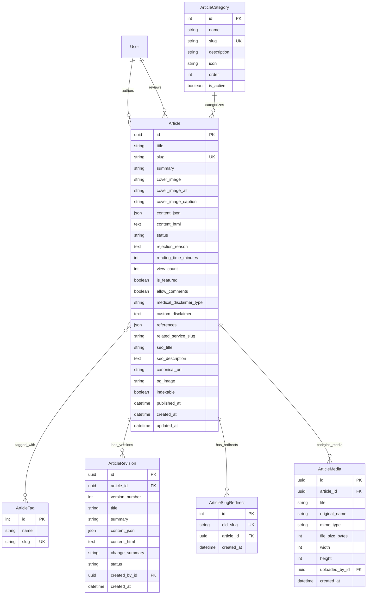

# معماری بک‌اند و مشخصات API ماژول مقالات پزشکی
## Backend Architecture & API Contract: Medical Articles & CMS Module

---

### ۱. معماری کلی اپلیکیشن در بک‌اند (Application Scope)
این ماژول به عنوان یک اپ مستقل جنگو تحت عنوان `apps.articles` پیاده‌سازی می‌شود.
طراحی این اپ به گونه‌ای است که کاملاً مستقل بوده و صرفاً با `apps.users` (جهت شناسایی پزشک و ادمین) و `apps.appointments` (جهت لینک به خدمات نوبت‌دهی) ارتباط دارد.

```
backend_core/apps/articles/
├── __init__.py
├── admin.py
├── apps.py
├── models.py                  # Article, ArticleCategory, ArticleTag, ArticleRevision, ArticleMedia, ArticleSlugRedirect
├── serializers.py             # Public & Admin Serializers (Detail, List, Minimal)
├── services.py                # Publishing workflow, revision merge, slug redirection, word-count/reading-time
├── selectors.py               # Optimized public queries, cache retrieval, search & filter
├── sanitizers.py              # HTML & TipTap JSON sanitization (anti-XSS using nh3/bleach)
├── media_services.py          # Image compression, WebP conversion, thumbnail generation, EXIF stripping
├── views.py                   # Public endpoints (list, detail by slug, categories, tags)
├── views_admin.py             # Admin/Doctor CMS endpoints (CRUD, publish, review, revisions, media upload)
├── urls.py                    # Public API routing: /api/articles/...
├── admin_urls.py              # Admin API routing: /api/admin/articles/...
├── pagination.py              # Standard 12-per-page pagination
└── migrations/
```

---

### ۲. مدل داده‌ای دیتابیس (Data Models & Schema)



#### ۲.۱. فیلدهای مدل `Article`
- **`id`**: `models.UUIDField(primary_key=True, default=uuid.uuid4, editable=False)`
- **`title`**: `models.CharField(max_length=255, db_index=True)`
- **`slug`**: `models.SlugField(max_length=255, unique=True, allow_unicode=True, db_index=True)`
- **`summary`**: `models.TextField(max_length=500, help_text="چکیده کوتاه مقاله جهت نمایش در کارت‌ها و سئو")`
- **`cover_image`**: `models.URLField(max_length=500, blank=True, null=True)`
- **`cover_image_alt`**: `models.CharField(max_length=255, blank=True, default="")`
- **`cover_image_caption`**: `models.CharField(max_length=255, blank=True, default="")`
- **`content_json`**: `models.JSONField(default=dict, help_text="ساختار درختی بلوک‌های ادیتور TipTap")`
- **`content_html`**: `models.TextField(blank=True, default="", help_text="کد HTML ضدعفونی‌شده و کش‌شده جهت رندر سریع")`
- **`author`**: `models.ForeignKey('users.User', on_delete=models.PROTECT, related_name='authored_articles')`
- **`reviewer`**: `models.ForeignKey('users.User', on_delete=models.SET_NULL, null=True, blank=True, related_name='reviewed_articles')`
- **`category`**: `models.ForeignKey(ArticleCategory, on_delete=models.PROTECT, related_name='articles')`
- **`tags`**: `models.ManyToManyField(ArticleTag, blank=True, related_name='articles')`
- **`status`**: `models.CharField(max_length=20, choices=[('DRAFT', 'پیش‌نویس'), ('PENDING_REVIEW', 'در انتظار بازبینی'), ('PUBLISHED', 'منتشرشده'), ('REJECTED', 'ردشده'), ('ARCHIVED', 'بایگانی‌شده')], default='DRAFT', db_index=True)`
- **`rejection_reason`**: `models.TextField(blank=True, null=True)`
- **`reading_time_minutes`**: `models.PositiveSmallIntegerField(default=3)`
- **`view_count`**: `models.PositiveIntegerField(default=0)`
- **`is_featured`**: `models.BooleanField(default=False, db_index=True)`
- **`allow_comments`**: `models.BooleanField(default=True)`
- **`medical_disclaimer_type`**: `models.CharField(max_length=20, choices=[('STANDARD', 'عمومی کلینیک'), ('SURGICAL', 'جراحی و تهاجمی'), ('CUSTOM', 'متن اختصاصی')], default='STANDARD')`
- **`custom_disclaimer`**: `models.TextField(blank=True, null=True)`
- **`references`**: `models.JSONField(default=list, blank=True)`
- **`related_service_slug`**: `models.CharField(max_length=100, blank=True, null=True)`
- **`seo_title`**: `models.CharField(max_length=255, blank=True, default="")`
- **`seo_description`**: `models.TextField(max_length=300, blank=True, default="")`
- **`canonical_url`**: `models.URLField(max_length=500, blank=True, null=True)`
- **`og_image`**: `models.URLField(max_length=500, blank=True, null=True)`
- **`indexable`**: `models.BooleanField(default=True)`
- **`published_at`**: `models.DateTimeField(null=True, blank=True, db_index=True)`
- **`created_at`**: `models.DateTimeField(auto_now_add=True)`
- **`updated_at`**: `models.DateTimeField(auto_now=True)`

**شاخص‌های دیتابیس (Composite Indexes):**
- `models.Index(fields=['status', '-published_at'])` (جهت بهینه‌سازی کوئری اصلی لندینگ مقالات)
- `models.Index(fields=['category', 'status', '-published_at'])` (جهت فیلتر دسته‌بندی‌ها)
- `models.Index(fields=['author', 'status'])` (جهت مقالات یک پزشک)

---

### ۳. قراردادهای API (API Contracts)

#### ۳.۱. اندپوینت‌های عمومی (Public Endpoints)

##### ۱. لیست مقالات منتشرشده (Public Articles List)
- **Method:** `GET`
- **Endpoint:** `/api/articles/`
- **Authentication:** اختیاری (بدون نیاز به توکن)
- **Query Parameters:**
  - `page`: int (پیش‌فرض ۱)
  - `page_size`: int (پیش‌فرض ۱۲، حداکثر ۵۰)
  - `category`: string (اسلاگ دسته‌بندی)
  - `tag`: string (اسلاگ تگ)
  - `search`: string (جستجو در عنوان و چکیده)
  - `ordering`: `-published_at` (پیش‌فرض), `-view_count`, `reading_time_minutes`
  - `is_featured`: boolean
- **Success Response (200 OK):**
```json
{
  "count": 48,
  "next": "/api/articles/?page=2",
  "previous": null,
  "results": [
    {
      "id": "c7a8b9e0-1234-5678-9abc-def012345678",
      "title": "راهنمای جامع خودآزمایی ماهانه پستان در منزل",
      "slug": "breast-self-exam-guide",
      "summary": "چگونگی لمس صحیح، زمان مناسب خودآزمایی در سیکل ماهانه و نشانه‌های مهم...",
      "cover_image": "https://cdn.clinic.ir/media/articles/2026/05/exam-guide.webp",
      "cover_image_alt": "تصویر نحوه خودآزمایی پستان",
      "category": {
        "id": 1,
        "name": "پیشگیری و غربالگری",
        "slug": "prevention"
      },
      "tags": [
        {"id": 3, "name": "خودآزمایی", "slug": "self-exam"},
        {"id": 7, "name": "سلامت زنان", "slug": "womens-health"}
      ],
      "author": {
        "id": 12,
        "full_name": "دکتر مهرافروز",
        "specialty": "فلوشیپ فوق‌تخصصی جراحی انکوپلاستی پستان",
        "medical_council_code": "98745",
        "avatar": "https://cdn.clinic.ir/media/doctors/mehrafrouz.webp"
      },
      "reading_time_minutes": 5,
      "view_count": 1240,
      "is_featured": true,
      "published_at": "2026-05-10T11:30:00Z"
    }
  ]
}
```

##### ۲. جزئیات کامل مقاله با اسلاگ (Public Article Detail)
- **Method:** `GET`
- **Endpoint:** `/api/articles/<slug>/`
- **Authentication:** عمومی
- **Behavior:**
  - ابتدا در جدول `ArticleSlugRedirect` چک می‌شود. اگر اسلاگ قدیمی باشد، وضعیت `301 Moved Permanently` با هدر `Location: /api/articles/<new_slug>/` بازگردانده می‌شود.
  - تعداد بازدید (`view_count`) با استفاده از `F('view_count') + 1` به صورت ایمن افزایش می‌یابد (یا با دی‌بانس آی‌پی در ردیس).
- **Success Response (200 OK):**
```json
{
  "id": "c7a8b9e0-1234-5678-9abc-def012345678",
  "title": "راهنمای جامع خودآزمایی ماهانه پستان در منزل",
  "slug": "breast-self-exam-guide",
  "summary": "چگونگی لمس صحیح، زمان مناسب خودآزمایی در سیکل ماهانه و نشانه‌های مهم...",
  "cover_image": "https://cdn.clinic.ir/media/articles/2026/05/exam-guide.webp",
  "cover_image_alt": "تصویر نحوه خودآزمایی پستان",
  "cover_image_caption": "آموزش گام‌به‌گام حرکات لمسی جهت تشخیص زودهنگام",
  "content_html": "<p>محتوای غنی و امن رندرشده...</p>",
  "category": {
    "id": 1,
    "name": "پیشگیری و غربالگری",
    "slug": "prevention"
  },
  "tags": [
    {"id": 3, "name": "خودآزمایی", "slug": "self-exam"}
  ],
  "author": {
    "id": 12,
    "full_name": "دکتر مهرافروز",
    "specialty": "فلوشیپ فوق‌تخصصی جراحی انکوپلاستی پستان",
    "medical_council_code": "98745",
    "avatar": "https://cdn.clinic.ir/media/doctors/mehrafrouz.webp"
  },
  "reviewer": {
    "id": 15,
    "full_name": "دکتر سارا شریفی",
    "specialty": "متخصص رادیولوژی و سونوگرافی مداخله‌ای"
  },
  "reading_time_minutes": 5,
  "view_count": 1241,
  "medical_disclaimer_type": "STANDARD",
  "custom_disclaimer": null,
  "references": [
    {
      "title": "American Cancer Society - Breast Cancer Screening Guidelines",
      "url": "https://cancer.org/guidelines",
      "doi": "10.3322/caac.21319"
    }
  ],
  "related_service": {
    "slug": "breast-oncoplastic-surgery",
    "title": "معاینه و جراحی انکوپلاستی پستان",
    "booking_enabled": true
  },
  "seo": {
    "title": "راهنمای خودآزمایی پستان | کلینیک دکتر مهرافروز",
    "description": "آموزش تصویری لمس صحیح بافت سینه در منزل جهت تشخیص به موقع توده‌ها...",
    "canonical_url": "https://kamelion.ir/articles/breast-self-exam-guide",
    "og_image": "https://cdn.clinic.ir/media/articles/2026/05/exam-guide.webp",
    "indexable": true
  },
  "related_articles": [
    {
      "id": "e4f5a6b7-...",
      "title": "تفاوت‌های کیست، فیبروآدنوم و توده‌های بدخیم",
      "slug": "cyst-vs-fibroadenoma",
      "cover_image": "https://cdn.clinic.ir/media/articles/cyst.webp",
      "reading_time_minutes": 7
    }
  ],
  "published_at": "2026-05-10T11:30:00Z",
  "updated_at": "2026-05-15T09:00:00Z"
}
```

##### ۳. لیست دسته‌بندی‌ها و برچسب‌های عمومی
- `GET /api/articles/categories/`
- `GET /api/articles/tags/`

---

#### ۳.۲. اندپوینت‌های مدیریت پنل ادمین و پزشک (Admin / Doctor CMS)
*تمامی این اندپوینت‌ها نیازمند احراز هویت ادمین/پرسنل (`IsStaffUser`) هستند.*

##### ۱. کارتابل مقالات ادمین (Admin Article List)
- **Method:** `GET`
- **Endpoint:** `/api/admin/articles/`
- **Query Params:** `status` (DRAFT, PENDING_REVIEW, PUBLISHED, etc.), `author_id`, `category_id`, `search`, `page`.

##### ۲. ایجاد پیش‌نویس مقاله جدید (Create Article Draft)
- **Method:** `POST`
- **Endpoint:** `/api/admin/articles/`
- **Request Body:**
```json
{
  "title": "تکنیک‌های نوین ترمیم زخم پس از ماموپلاستی",
  "slug": "wound-healing-after-mammoplasty",
  "summary": "بررسی روش‌های کاهش اسکار و ترمیم سریع‌تر با پانسمان‌های هوشمند...",
  "cover_image": "https://cdn.clinic.ir/media/articles/wound.webp",
  "cover_image_alt": "پانسمان زخم پس از جراحی",
  "content_json": {
    "type": "doc",
    "content": [...]
  },
  "category_id": 2,
  "tag_ids": [3, 9],
  "medical_disclaimer_type": "SURGICAL",
  "references": [
    {"title": "Wound Care in Plastic Surgery", "url": "https://ncbi.nlm.nih.gov/..."}
  ],
  "related_service_slug": "mammoplasty",
  "seo_title": "مراقبت از زخم ماموپلاستی | دکتر مهرافروز",
  "seo_description": "چگونه اسکار و جای بخیه ماموپلاستی را به حداقل برسانیم؟"
}
```
- **Response:** `201 Created` همراه با تمام اطلاعات و وضعیت پیش‌فرض `DRAFT`.

##### ۳. بارگذاری تصویر مقاله (Upload Article Image)
- **Method:** `POST`
- **Endpoint:** `/api/admin/articles/media/upload/`
- **Content-Type:** `multipart/form-data`
- **Payload:** `file` (حداکثر ۵ مگابایت)
- **Processing:** بررسی امنیتی MIME، تبدیل خودکار به فرمت بهینه WebP، تولید تامبنیل و ذخیره با UUID یکتا.
- **Response (200 OK):**
```json
{
  "url": "https://cdn.clinic.ir/media/articles/2026/10/a8b9c0d1.webp",
  "thumbnail_url": "https://cdn.clinic.ir/media/articles/2026/10/a8b9c0d1_thumb.webp",
  "width": 1200,
  "height": 675,
  "size_kb": 142
}
```

##### ۴. تغییر وضعیت و گردش کار انتشار (Workflow Actions)
- **ارسال جهت بازبینی:** `POST /api/admin/articles/<uuid>/submit-review/`
- **تایید و انتشار فوری:** `POST /api/admin/articles/<uuid>/publish/`
- **رد مقاله با بازخورد:** `POST /api/admin/articles/<uuid>/reject/` (با پارامتر `rejection_reason`)
- **خروج از انتشار / بایگانی:** `POST /api/admin/articles/<uuid>/unpublish/`

##### ۵. مدیریت نسخه‌ها و تاریخچه تغییرات (Revisions)
- **مشاهده لیست نسخه‌های یک مقاله:** `GET /api/admin/articles/<uuid>/revisions/`
- **بازگردانی به نسخه مشخص (Rollback):** `POST /api/admin/articles/<uuid>/revisions/<rev_id>/restore/`
- **تایید نسخه در حال ویرایش مقاله منتشرشده:** `POST /api/admin/articles/<uuid>/revisions/<rev_id>/approve/`
