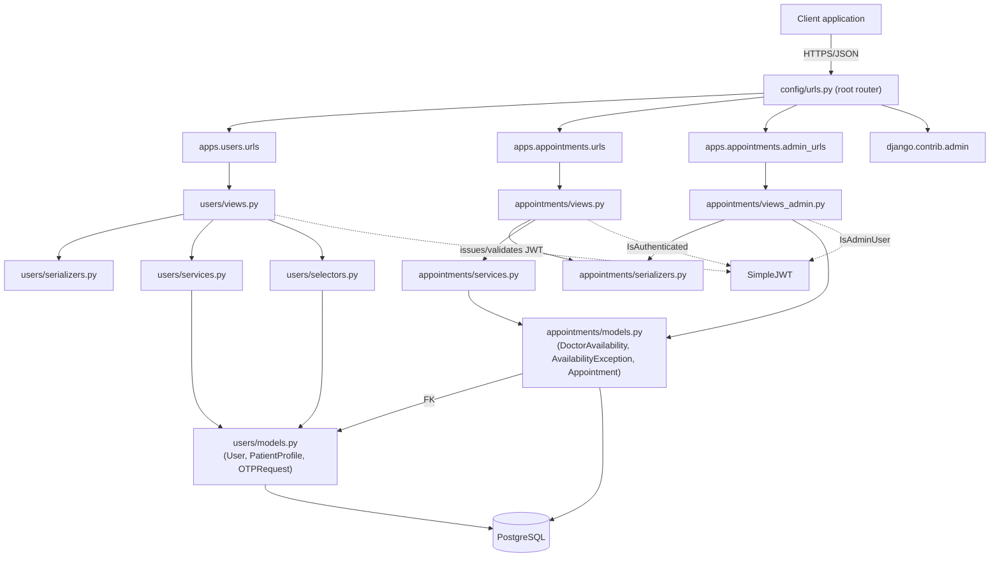
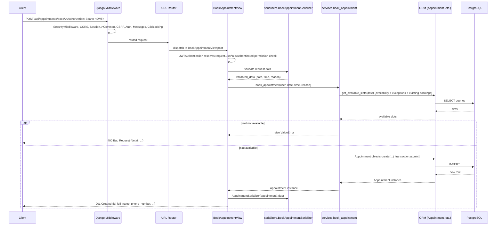

# Backend Architecture

> Scope: this document describes the **current implementation** of `backend_core` as found in the repository. It does not describe planned or proposed work. Anything defined but not yet wired up (e.g. unused configuration, empty apps) is called out explicitly as such.

## 1. Technology Stack

| Layer | Technology |
|---|---|
| Language / runtime | Python 3, Django (`django>=4.2`, project generated against Django 5.x/6.x per migration headers) |
| Web framework | Django + Django REST Framework (`djangorestframework>=3.15`) |
| Authentication | `djangorestframework-simplejwt>=5.3` (JWT), plus Django's built-in session/auth middleware |
| Database | PostgreSQL, via `psycopg2-binary>=2.9` |
| Config management | `python-decouple>=3.8` (reads from `.env` / environment variables) |
| HTTP client | `httpx>=0.27` (declared as a dependency; see §7 for current usage status) |
| CORS | `django-cors-headers>=4.3` |
| Servers exposed | WSGI (`config/wsgi.py`) and ASGI (`config/asgi.py`), both standard Django entry points |

There is a `package.json` at the project root with a single dependency (`dom`) and no build scripts. It is not part of the Django application's runtime and does not participate in serving the backend — no frontend/Node tooling is invoked by the Django app.

## 2. Project Structure

```
backend_core/
├── manage.py                  # Django management entry point
├── requirements.txt           # Python dependencies
├── .env                       # Environment variables (not committed in practice; read via python-decouple)
├── config/                    # Project-level configuration (the Django "project")
│   ├── settings.py            # Single settings module (no per-environment split)
│   ├── urls.py                # Root URL routing
│   ├── wsgi.py
│   └── asgi.py
└── apps/                      # Django "apps" (feature modules)
    ├── users/                 # Authentication, user & patient profile data
    │   ├── models.py
    │   ├── serializers.py
    │   ├── services.py        # Business logic (OTP generation/verification)
    │   ├── selectors.py       # Read-oriented data access helpers
    │   ├── views.py
    │   ├── urls.py
    │   ├── admin.py
    │   └── migrations/
    ├── appointments/          # Scheduling domain: availability, exceptions, bookings
    │   ├── models.py
    │   ├── serializers.py
    │   ├── services.py        # Business logic (slot generation, booking, cancellation)
    │   ├── views.py           # Patient-facing endpoints
    │   ├── views_admin.py     # Admin/staff-facing endpoints
    │   ├── urls.py            # Patient-facing routes
    │   ├── admin_urls.py      # Admin-facing routes
    │   ├── pagination.py
    │   ├── admin.py
    │   └── migrations/
    ├── chat_gateway/          # Scaffolded app, no implementation yet (see §8)
    └── common/                # Scaffolded app, no implementation yet (see §8)
```

The project follows Django's standard "project + apps" layout, with `config/` acting as the project package and each subfolder of `apps/` acting as an independent Django app registered in `INSTALLED_APPS`.

## 3. Layering & Responsibilities

Within each feature app (`users`, `appointments`), the code is organized in a light **service-layer pattern** on top of standard DRF:

- **`models.py`** — ORM models and model-level validation (`clean()`), database constraints and indexes. This is the source of truth for the data shape.
- **`serializers.py`** — Request/response (de)serialization and field-level/cross-field validation for the API boundary. Both plain `Serializer` classes (for RPC-style actions such as OTP requests) and `ModelSerializer` classes (for CRUD-style resources) are used depending on the endpoint.
- **`services.py`** — Business logic that doesn't belong in a model or a view: OTP issuance/verification, slot generation, booking/cancellation rules. Services are plain functions, several wrapped in `@transaction.atomic` where multi-step consistency matters.
- **`selectors.py`** *(users only)* — Read-oriented helper(s) for fetching/creating related data (e.g. `get_patient_profile`). Currently defined but not called from any view.
- **`views.py` / `views_admin.py`** — DRF `APIView`, `ListAPIView`, and `ModelViewSet` classes. Views are thin: they validate input via a serializer, delegate to a service function, and shape the HTTP response. Admin-only endpoints are kept in a separate `views_admin.py` file within the same app rather than a separate app.
- **`urls.py` / `admin_urls.py`** — Per-app routing, included from the root `config/urls.py`. Splitting patient-facing and admin-facing URLs into separate files is a consistent pattern in `appointments` and is used to organize `admin/`-prefixed routes.
- **`admin.py`** — Django admin registrations for staff/superuser browsing of data (independent of the DRF API).
- **`pagination.py`** *(appointments only)* — A shared `PageNumberPagination` subclass used by list endpoints.

There is no separate "repository" or "DAO" layer beyond Django's ORM; services call the ORM directly.

## 4. Component Relationships & Communication



Key points:

- **Apps communicate through Python-level imports, not HTTP.** `appointments.models` imports `User` directly from `apps.users.models` to establish the `Appointment.user` foreign key. There is no internal service-to-service HTTP call between `users` and `appointments`.
- **Views never touch the ORM directly for writes** in the appointments/users flows that have business rules (OTP issuance, booking) — they call into `services.py`, which encapsulates the logic and transaction boundaries. Simple reads (e.g. `MyAppointmentsView`, `AdminAppointmentsView`) query the ORM directly from the view since there's no non-trivial logic to encapsulate.
- **`chat_gateway`** is registered as an app and has settings reserved for it (`FASTAPI_BASE_URL`, `FASTAPI_TIMEOUT`) but currently contains no models, views, or routes — see §8.

## 5. API Structure & Endpoint Organization

All API routes are mounted under `/api/` from `config/urls.py`:

```python
urlpatterns = [
    path('admin/', admin.site.urls),                              # Django admin UI
    path("api/admin/", include("apps.appointments.admin_urls")),  # Staff/admin API
    path("api/", include("apps.users.urls")),                     # Auth API
    path("api/appointments/", include("apps.appointments.urls")), # Patient-facing appointments API
]
```

### Patient-facing / public endpoints

| Method | Path | View | Auth |
|---|---|---|---|
| POST | `/api/auth/request-otp` | `RequestOTPView` | None |
| POST | `/api/auth/verify-otp` | `VerifyOTPView` | None |
| POST | `/api/auth/admin/login` | `AdminLoginView` | None (validates staff credentials internally) |
| GET | `/api/appointments/slots/` | `AvailableSlotsView` | None |
| POST | `/api/appointments/book/` | `BookAppointmentView` | JWT (`IsAuthenticated`) |
| GET | `/api/appointments/my/` | `MyAppointmentsView` | JWT (`IsAuthenticated`) |
| POST | `/api/appointments/<int:pk>/cancel/` | `CancelAppointmentView` | JWT (`IsAuthenticated`) |

### Admin-facing endpoints (`/api/admin/...`)

| Method | Path | View | Auth |
|---|---|---|---|
| GET/POST/PUT/PATCH/DELETE | `/api/admin/slots/` (DRF router) | `AdminSlotViewSet` | JWT (`IsAdminUser`) |
| GET/POST/PUT/PATCH/DELETE | `/api/admin/exceptions/` (DRF router) | `AdminExceptionViewSet` | JWT (`IsAdminUser`) |
| PUT | `/api/admin/slots/bulk/` | `AdminSlotBulkSaveView` | JWT (`IsAdminUser`) |
| PUT | `/api/admin/exceptions/bulk/` | `AdminExceptionBulkSaveView` | JWT (`IsAdminUser`) |
| GET | `/api/admin/appointments/` | `AdminAppointmentsView` | JWT (`IsAdminUser`) |

Notes on structure:
- `admin_urls.py` mixes a DRF `DefaultRouter` (for the two `ModelViewSet`s, giving standard list/create/retrieve/update/delete routes) with explicitly declared `path()` entries for the bulk-save and appointments-list endpoints.
- The bulk-save endpoints (`slots/bulk/`, `exceptions/bulk/`) implement an upsert-and-prune pattern: any existing record not present in the submitted payload is deleted, everything else is created or updated, all inside one atomic transaction.
- The admin appointments list supports search via a `?search=` query parameter, matching against patient name/phone number with a simple relevance ranking (exact match ranked above partial match), plus standard pagination (`page`, `page_size` up to 100).
- There is a naming collision worth noting: both `appointments/views.py` and `appointments/views_admin.py` define a class named `AdminAppointmentsView`. Only the one in `views_admin.py` is actually routed (from `admin_urls.py`); the one in `views.py` is unused dead code.

## 6. Database Structure & Data Access

**Engine:** PostgreSQL, configured in `config/settings.py` via `django.db.backends.postgresql`, with connection parameters (`DB_NAME`, `DB_USER`, `DB_PASSWORD`, `DB_HOST`, `DB_PORT`) sourced from environment variables through `python-decouple`.

**Access pattern:** all database access goes through the Django ORM — there is no raw SQL, no separate query builder, and no additional data-access abstraction beyond `selectors.py`/`services.py` calling model managers directly (`Model.objects...`).

### Schema (current models)

**`apps.users`**
- `User` (custom, `AUTH_USER_MODEL = 'users.User'`) — extends `AbstractBaseUser` + `PermissionsMixin`. Login identifier is `phone_number` (unique), not username/email. Regular users have no usable password (OTP-only login); staff/superusers have a real password. Indexed on `phone_number`.
- `PatientProfile` — one-to-one with `User` (`related_name="patient_profile"`), holds `national_id` (unique, optional), `date_of_birth`, `address`. Kept separate from `User` to isolate auth data from profile/medical-context data. Indexed on `national_id` and `date_of_birth`.
- `OTPRequest` — stores issued OTP codes per `phone_number` with `code`, `created_at`, `expires_at` (defaults to +5 minutes on save), and `is_used`. Indexed on `(phone_number, is_used)` and `expires_at`.

**`apps.appointments`**
- `DoctorAvailability` — a named weekly recurring schedule: `days_of_week` (JSON list of day codes), `start_time`, `end_time`, `visit_duration` (minutes), `time_gap` (minutes between visits), `is_active`. Model-level `clean()` (invoked via an overridden `save()` calling `full_clean()`) enforces valid/non-duplicate days, `end_time > start_time`, positive visit duration, and non-negative gap.
- `AvailabilityException` — a blocked date range (`start_date`, `end_date`, optional `reason`), used to represent clinic closures that override normal weekly availability. Enforced at the database level with a `CheckConstraint` (`end_date >= start_date`) in addition to indexing on `(start_date, end_date)`.
- `Appointment` — a booking: `user` (FK to `User`, `on_delete=CASCADE`), `appointment_date`, `appointment_time`, optional `reason`, and `status` (`scheduled` / `cancelled_user` / `cancelled_admin` / `visited`). A partial unique constraint (`unique_scheduled_appointment_slot`, active only when `status="scheduled"`) prevents double-booking the same date/time at the database level, on top of the application-level check in `services.book_appointment`. Indexed on `(appointment_date, appointment_time)`, `status`, and `(user, appointment_date)`.

Migrations are managed per-app in the standard Django way (`apps/*/migrations/`); the `appointments` app schema has evolved across 3 migrations (initial → status/field cleanup → replacing the single `day_of_week` field with a `days_of_week` JSON list and adding `name`/timestamps to `DoctorAvailability`).

## 7. Authentication & Authorization

- **Mechanism:** JWT, via `djangorestframework-simplejwt`. `REST_FRAMEWORK['DEFAULT_AUTHENTICATION_CLASSES']` is set globally to `JWTAuthentication`, and `DEFAULT_PERMISSION_CLASSES` defaults every view to `IsAuthenticated` unless a view explicitly overrides it.
- **Token lifetimes:** access tokens last 7 days, refresh tokens 30 days (`SIMPLE_JWT` in settings). Tokens are sent as `Authorization: Bearer <token>`.
- **Patient login flow (passwordless, OTP-based):**
  1. `POST /api/auth/request-otp` with a phone number → `services.request_otp` invalidates any previous unused OTPs for that number, generates a 6-digit code, stores it with a 5-minute expiry. (The code is currently only printed to server logs — no SMS provider is integrated; see the `# TODO: integrate SMS provider here` comment in `services.py`.)
  2. `POST /api/auth/verify-otp` with phone number + code → `services.verify_otp` checks the code is valid/unused/not expired inside an atomic transaction, marks it used, and does a `get_or_create` on `User` (so first-time verification implicitly registers the user). A JWT access/refresh pair is issued.
  - Both endpoints explicitly clear `authentication_classes`/`permission_classes` since they must be reachable without a token.
- **Admin/staff login flow (password-based):** `POST /api/auth/admin/login` uses Django's `authenticate()` against `phone_number`/`password`, requires `user.is_staff`, `user.is_active`, and returns a JWT pair plus a small user payload (with a hardcoded `"role": "admin"`).
- **Authorization:** enforced per-view via DRF permission classes — patient endpoints that require login use `IsAuthenticated`; all admin endpoints (`views_admin.py`) use `IsAdminUser` (i.e., `is_staff`). There is no custom role/permission system beyond Django's built-in `is_staff`/`is_superuser` flags and DRF's stock permission classes — no groups, object-level permissions, or scopes are used.
- **CSRF/CORS:** since the API is JWT-authenticated (not session-cookie-authenticated) CSRF is not the primary protection for the API endpoints, though Django's `CsrfViewMiddleware` remains active project-wide (relevant to the Django admin, which does use sessions). CORS is restricted to two local dev origins (`localhost:5173` / `127.0.0.1:5173`) via `django-cors-headers`.

## 8. External Services & Integrations

- **PostgreSQL** is the only external service the backend actively integrates with today.
- **Planned/reserved but not implemented:** `FASTAPI_BASE_URL` and `FASTAPI_TIMEOUT` are defined in `settings.py` (suggesting an intended gateway to a separate FastAPI service, and `httpx` is listed as a dependency to support that), and an app named `chat_gateway` exists and is registered in `INSTALLED_APPS`. However, `chat_gateway` currently contains only Django's default generated `models.py`/`views.py`/`admin.py` stubs — no models, no views, no URLs, and it is not included in `config/urls.py`. No code anywhere in the project reads `FASTAPI_BASE_URL`/`FASTAPI_TIMEOUT` or uses `httpx`. This documentation reflects that current (unimplemented) state rather than the evident intent.
- **`apps.common`** is likewise registered in `INSTALLED_APPS` but contains no models, views, or shared logic beyond the default stubs — it currently does not provide any cross-app functionality.
- No SMS/email provider, payment gateway, or other third-party API is currently called from the code (see the OTP delivery note in §7).

## 9. Request Lifecycle

Example: a patient booking an appointment (`POST /api/appointments/book/`), representative of the general request flow.



General shape for every request:

1. Request enters through WSGI/ASGI and passes through the middleware stack defined in `MIDDLEWARE` (security headers → CORS → session → common → CSRF → auth → messages → clickjacking), in that order.
2. `config/urls.py` dispatches to the matching app's `urls.py`/`admin_urls.py`, which resolves to a specific view class.
3. DRF authenticates the request (`JWTAuthentication`, unless the view clears `authentication_classes`) and checks the view's `permission_classes`.
4. The view validates incoming data with a serializer.
5. For non-trivial logic, the view calls a function in `services.py`, which performs the business rules and any database writes (often inside `transaction.atomic`); for simple reads, the view queries the ORM directly.
6. The result is serialized back out (typically the same or a `ModelSerializer`) and returned as a DRF `Response` with an explicit HTTP status code.

## 10. Notable Architectural Decisions

- **Custom phone-number-based `User` model with OTP login.** Chosen over username/email + password, presumably to match the patient-facing product's login flow. This requires the model to override password handling (`set_unusable_password()` for regular users) and to keep a separate `create_superuser` path for admin accounts, which do get a real password.
- **Thin views, logic in `services.py`.** Keeps view classes focused on HTTP concerns (validation, status codes, permissions) while business rules (slot generation, booking races, OTP lifecycle) live in testable, framework-agnostic functions. Multi-step mutations are wrapped in `transaction.atomic` to keep them consistent.
- **Separation of patient-facing and admin-facing views/URLs within the same app** (`views.py`/`urls.py` vs. `views_admin.py`/`admin_urls.py`) rather than a dedicated `admin` app. This keeps the domain models and services shared in one place while still isolating admin-only permission requirements (`IsAdminUser`) and admin-only serializers/behaviors (e.g. bulk upsert-and-prune for schedules).
- **Double-booking prevented at two levels.** The `services.book_appointment` function checks slot availability before creating a row, and a partial `UniqueConstraint` at the database level (`status='scheduled'`) provides a second, race-condition-safe guarantee independent of application logic.
- **Single settings module, no per-environment split.** `config/settings.py` uses `python-decouple` to read all environment-specific values (secret key, debug flag, DB credentials, FastAPI URL/timeout) from environment variables/`.env`, rather than maintaining separate `settings/dev.py`, `settings/prod.py`, etc.
- **`ALLOWED_HOSTS = ['*']`** is currently wide open, which is a notable, likely dev-oriented, configuration choice rather than a hardened production setting.

## 11. Known Gaps / Inconsistencies in the Current Implementation

Documented here for completeness since the task calls for reflecting the *current* implementation, warts included:

- `chat_gateway` and `common` apps are registered but unimplemented (§8).
- `FASTAPI_BASE_URL`/`FASTAPI_TIMEOUT` settings and the `httpx` dependency are unused by any current code path.
- `apps/appointments/views.py` contains an `AdminAppointmentsView` that is dead code (shadowed/unused; the routed admin view of the same name lives in `views_admin.py`).
- `users/selectors.py::get_patient_profile` is imported in `users/views.py` but never invoked by any view — there is currently no endpoint that reads or writes `PatientProfile` data.
- OTP codes are written to server logs (`print(...)`) rather than delivered via SMS; there is no SMS integration yet.
- `ALLOWED_HOSTS = ['*']` and CORS/CSRF trusted origins limited to local dev URLs suggest the checked-in settings reflect a development configuration.
