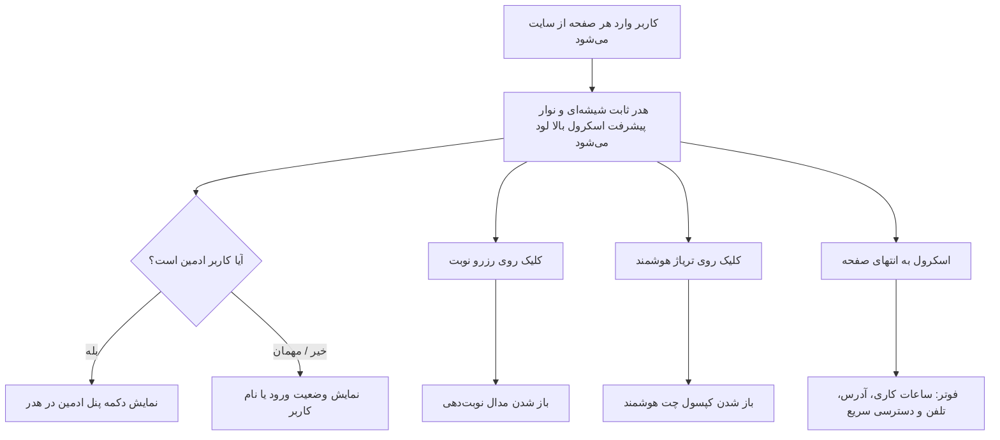

# سند طراحی محصول (PRD) — لایوت عمومی و ناوبری سراسری
## Product Requirement Document: Global Layout & Navigation System

---

### ۱. مشخصات سند (Document Metadata)
- **شناسه سند:** `PRD-FE-001`
- **ماژول:** لایوت عمومی و تجربه کاربری پایه (Public UI / Global Shell)
- **وضعیت پیاده‌سازی:** ✅ پیاده‌سازی کامل (Completed)
- **کامپوننت‌های فرانت‌اند:**
  - هدر شیشه‌ای و ناوبری: [`src/components/layout/Header.jsx`](file:///e:/GitHub%20Repo/kamelion/front-end/src/components/layout/Header.jsx)
  - فوتر کلینیک: [`src/components/layout/Footer.jsx`](file:///e:/GitHub%20Repo/kamelion/front-end/src/components/layout/Footer.jsx)
  - فریم‌ورک اصلی و روتینگ: [`src/App.jsx`](file:///e:/GitHub%20Repo/kamelion/front-end/src/App.jsx)
- **سرویس‌ها و استورها:**
  - استور تم: [`src/store/themeStore.js`](file:///e:/GitHub%20Repo/kamelion/front-end/src/store/themeStore.js)
  - هوک مدیریت اسکرول: [`src/hooks/useScrollFade.js`](file:///e:/GitHub%20Repo/kamelion/front-end/src/hooks/useScrollFade.js)

---

### ۲. هدف و ارزش بیزینسی (Product Vision & Goals)
- **بیان مسئله:** بیماران نیازمند بستری آرامش‌بخش، قابل اعتماد و سریع برای دسترسی به خدمات پزشکی پستان هستند. ناوبری پیچیده یا لایوت شلوغ باعث سردرگمی بیماران در شرایط استرس‌زا می‌شود.
- **ارزش بیزینسی:** لایوت مدرن با طراحی گلس‌مورفیک (Glassmorphism) و دسترسی دائمی به دو اقدام کلیدی (رزرو نوبت و تریاژ هوشمند)، نرخ تبدیل مراجعین به نوبت‌های ثبت‌شده را به حداکثر می‌رساند.
- **اهداف کلیدی:**
  - دسترسی آسان به نوبت‌دهی و تریاژ از هر صفحه با یک کلیک.
  - نمایش اعتبار و تخصص کلینیک با هویت بصری یکپارچه.
  - نمایش وضعیت ورود کاربر و دکمه میانبر اختصاصی برای کادر درمان و ادمین.

---

### ۳. پرسوناها و ذی‌نفعان (Target Personas)
- **مراجعین و بیماران جدید:** نیاز به مرور سریع خدمات، رزرو نوبت و گفتگوی فوری دارند.
- **بیماران دارای حساب کاربری:** نیاز به مشاهده نام و وضعیت ورود خود دارند.
- **کادر درمان و ادمین کلینیک:** هنگام ورود با حساب ادمین، باید لینک مستقیم دسترسی به پنل مدیریت کلینیک (`/admin`) را در نوار بالای سایت ببینند.

---

### ۴. جریان کاربر (User Journey & Flow)

---

### ۵. الزامات عملکردی (Functional Requirements)
1. **هدر چسبان (Sticky Glassmorphic Header):**
   - در تمام صفحات عمومی فعال است و با اسکرول صفحه در بالای صفحه ثابت می‌ماند (`backdrop-blur-md`).
   - شامل لوگوی مطب، نام دکتر نگار مشهوری، لینک‌های منو (`خانه`، `درباره پزشک`، `خدمات`، `ویدیوها`، `پرسش‌های متداول`، `مقالات`).
2. **اقدامات فوری (CTA Buttons):**
   - دکمه برجسته «رزرو آنلاین نوبت» که `AppointmentModal` را باز می‌کند.
   - دکمه «تریاژ و مشاوره هوشمند» که کپسول `FloatingChatWidget` را باز می‌کند.
3. **نوار پیشرفت اسکرول (Top Scroll Progress):**
   - یک خط باریک در بالاترین پیکسل صفحه (`#progress`) که درصد اسکرول کاربر در صفحه جاری را نشان می‌دهد.
4. **منوی واکنش‌گرا (Mobile Drawer):**
   - در صفحات موبایل و تبلت، منو به دکمه همبرگری تبدیل شده و با انیمیشن نرم از سمت راست (RTL) باز می‌شود.
5. **فوتر جامع (Clinic Footer):**
   - اطلاعات تماس، ساعات کاری دقیق روزهای شنبه تا چهارشنبه، آدرس کلینیک در تهران، لینک‌های مجوز و حقوق معنوی.

---

### ۶. مشخصات رابط کاربری و تجربه کاربری (UI/UX)
- **سبک طراحی:** Glassmorphism ملایم، گرادیانت‌های اختصاصی منطبق بر تم فعال (`--primary`، `--bg-light`، `--text-dark`).
- **جهت‌گیری:** ۱۰۰٪ راست‌به‌چپ (RTL) با تایپوگرافی فارسی استاندارد.
- **ریسپانسیو:** سازگاری کامل با عرض‌های ۳۶۰px (موبایل کوچک)، ۷۶۸px (تبلت) و ۱۰۲۴px به بالا (دسکتاپ).
- **مخفی‌سازی در پنل ادمین:** هدر و فوتر عمومی در مسیرهای `/admin/*` مخفی شده و لایوت اختصاصی ادمین (`AdminLayout`) جایگزین می‌شود.

---

### ۷. مدیریت وضعیت و قرارداد داده
- **کنترل مودال‌ها در سطح ریشه (`App.jsx`):**
  - وضعیت `openAppointment` (boolean) برای کنترل مدال رزرو.
  - وضعیت `openChat` (boolean) برای کنترل ویجت تریاژ.
- **اطلاعات کاربر از استور:**
  - خواندن `isAuthenticated`, `user`, `isAdmin` از `authStore`.

---

### ۸. وابستگی‌ها و عدم رگرسیون (Invariants)
- **نباید تغییر کند:** مسیرهای منوی اصلی (`/`, `/about`, `/services`, `/faq`, `/resources`, `/video`).
- **عدم تداخل:** عملکرد دکمه رزرو نوبت نباید روت کاربر را تغییر دهد، بلکه باید در همان صفحه جاری مدال را باز کند تا تمرکز کاربر از بین نرود.

---

### ۹. حالات مرزی (Edge Cases)
- در تغییر مسیر صفحات (`useLocation`)، اسکرول صفحه باید بلافاصله به بالای صفحه (`window.scrollTo(0, 0)`) بازگردد.
- هنگام باز شدن منوی موبایل، اسکرول صفحه پس‌زمینه باید مهار شود تا از لغزش ناخواسته جلوگیری شود.
