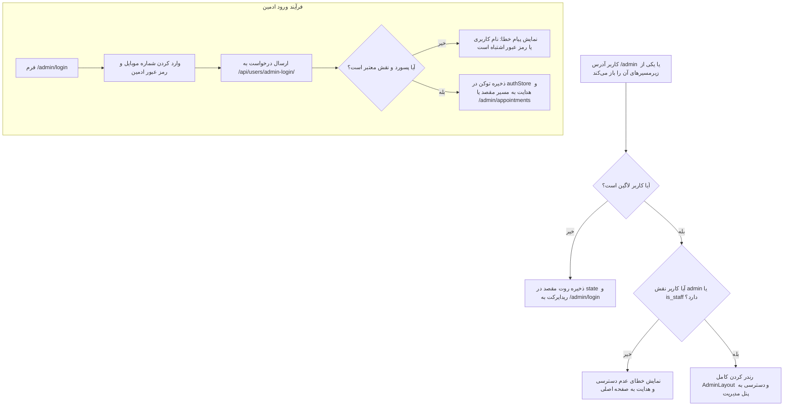

# سند طراحی محصول (PRD) — ورود ادمین و گارد مسیرهای مدیریتی
## Product Requirement Document: Admin Authentication & Route Protection

---

### ۱. مشخصات سند (Document Metadata)
- **شناسه سند:** `PRD-FE-003`
- **ماژول:** امنیت و دسترسی کادر درمان (Admin Auth & Security)
- **وضعیت پیاده‌سازی:** ✅ پیاده‌سازی کامل (Completed)
- **کامپوننت‌های فرانت‌اند:**
  - صفحه ورود ادمین: [`src/pages/admin/AdminLogin.jsx`](file:///e:/GitHub%20Repo/kamelion/front-end/src/pages/admin/AdminLogin.jsx)
  - محافظت مسیر ادمین: [`src/components/admin/AdminProtectedRoute.jsx`](file:///e:/GitHub%20Repo/kamelion/front-end/src/components/admin/AdminProtectedRoute.jsx)
  - گارد کنترل نقش: [`src/guards/RoleGuard.jsx`](file:///e:/GitHub%20Repo/kamelion/front-end/src/guards/RoleGuard.jsx)
- **سرویس‌ها و هوک‌ها:**
  - هوک اعتبارسنجی: [`src/hooks/useAuth.js`](file:///e:/GitHub%20Repo/kamelion/front-end/src/hooks/useAuth.js)
  - استور نشست: [`src/store/authStore.js`](file:///e:/GitHub%20Repo/kamelion/front-end/src/store/authStore.js)

---

### ۲. هدف و ارزش بیزینسی (Product Vision & Goals)
- **بیان مسئله:** اطلاعات پزشکی بیماران، پرونده‌ها، نظرات مراجعین و زمان‌بندی پزشک از حساس‌ترین داده‌های محرمانه هستند و تحت هیچ شرایطی نباید بدون اعتبارسنجی سطح دسترسی در اختیار کاربران عادی یا مهمان قرار گیرند.
- **ارزش بیزینسی:** تفکیک کامل لایه مراجعین از لایه مدیریت از طریق احراز هویت مبتنی بر کلمه عبور و کنترل نقش (`is_staff` / `is_superuser` / `role: admin`) امنیت صد در صدی داده‌های کلینیک را تضمین می‌کند.
- **اهداف کلیدی:**
  - جلوگیری از نفوذ غیرمجاز به مسیرهای `/admin/*`.
  - هدایت خودکار کاربر پس از لاگین به همان صفحه‌ای که قصد بازدید داشته است (`redirect back`).
  - پاک‌سازی امن توکن‌ها در زمان خروج یا انقضای نشست.

---

### ۳. پرسوناها و ذی‌نفعان (Target Personas)
- **دکتر نگار معشوری (پزشک متخصص):** ورود با دسترسی سوپریوزر جهت تنظیم ساعت حضور، مشاهده پرونده‌ها و تنظیم تم کلینیک.
- **منشی و دستیار کلینیک:** ورود با دسترسی ادمین/پرسنل (`is_staff`) جهت مدیریت نوبت‌ها و استثنائات زمانی.
- **کاربران عادی / نفوذگران:** در صورت تلاش برای دسترسی به آدرس‌های ادمین، بلافاصله به صفحه لاگین ادمین یا صفحه اصلی ریدایرکت می‌شوند.

---

### ۴. جریان کاربر و گارد امنیتی (User Journey & Security Guard Flow)



---

### ۵. الزامات عملکردی (Functional Requirements)
1. **فرم اختصاصی ورود ادمین (`/admin/login`):**
   - فیلد شماره تماس ادمین (آیکون کاربری) و فیلد کلمه عبور (آیکون قفل).
   - اعتبارسنجی عدم خالی بودن و حداقل طول رمز عبور.
2. **بررسی سفت‌وسخت پرمیشن (Strict Role Verification):**
   - حتی در صورت داشتن توکن JWT، کلاینت پرچم‌های `is_staff`، `is_superuser` یا `role === 'admin'` را بررسی می‌کند؛ کاربران عادی اجازه ورود به پنل ادمین را ندارند.
3. **مکانیزم بازگشت به مسیر مقصد (Deep Linking / Redirect Back):**
   - اگر کاربری تلاش کند به آدرس `/admin/patients` برود و لاگین نباشد، پس از ورود موفق، دقیقاً به `/admin/patients` منتقل می‌شود و نه صفحه پیش‌فرض.
4. **خروج امن از سیستم (Admin Logout):**
   - با کلیک روی خروج در سایدبار ادمین، توکن‌ها بی‌درنگ باطل و استور ریست شده و کلاینت به صفحه اصلی هدایت می‌شود.

---

### ۶. مشخصات رابط کاربری و تجربه کاربری (UI/UX)
- **طراحی فرم لاگین ادمین:** پس‌زمینه گرادیانت مجلل، شیلد امنیتی در هدر باکس لاگین، کارت شناور با گوشه‌های گرد ۴۰px (`rounded-[2.5rem]`).
- **حالت‌های تعاملی دکمه:** نمایش اسپینر نرم `Loader2` در زمان اعتبارسنجی شبکه.
- **پیام خطای شفاف:** نمایش خطاهای احراز هویت در بنر با حاشیه و متن هشدار.

---

### ۷. قرارداد وب سرویس (API Contract)
- **درخواست ورود ادمین:**
  - `POST /api/users/admin-login/`
  - Payload:
    ```json
    {
      "phone_number": "09120000000",
      "password": "StrongAdminPassword123"
    }
    ```
  - Response (200 OK):
    ```json
    {
      "access": "eyJhbGci...",
      "refresh": "eyJhbGci...",
      "user": {
        "id": 1,
        "name": "دکتر نگار معشوری",
        "phone_number": "09120000000",
        "role": "admin",
        "is_staff": true,
        "is_superuser": true
      }
    }
    ```

---

### ۸. وابستگی‌ها و مهار رگرسیون (Invariants)
- **پایداری کامپوننت `AdminProtectedRoute`:** تمام روت‌های فرزند ادمین در `App.jsx` تحت فرزند این کامپوننت قرار دارند و نباید به هیچ عنوان این لایه حفاظتی برداشته شود.
- **تغییر توکن در رفرش:** در صورت خطای `401 Unauthorized` در فراخوانی‌های بعدی API، اینترسپتور به صورت خودکار با `refresh_token` نشست را تمدید می‌کند و در صورت شکست، کاربر به لاگین منتقل می‌شود.
