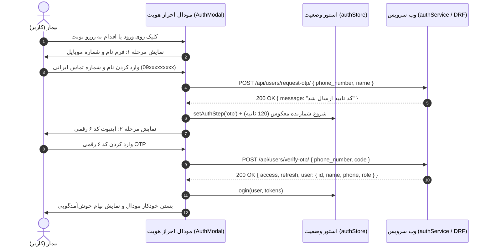

# سند طراحی محصول (PRD) — احراز هویت بیماران از طریق رمز یکبار مصرف (OTP)
## Product Requirement Document: Patient Authentication & OTP Modal Flow

---

### ۱. مشخصات سند (Document Metadata)
- **شناسه سند:** `PRD-FE-002`
- **ماژول:** احراز هویت و مدیریت نشست بیماران (Patient Authentication)
- **وضعیت پیاده‌سازی:** ✅ پیاده‌سازی کامل رابط کاربری و وب سرویس (Completed)
- **کامپوننت‌های فرانت‌اند:**
  - مودال ورود/ثبت‌نام: [`src/components/ui/AuthModal.jsx`](file:///e:/GitHub%20Repo/kamelion/front-end/src/components/ui/AuthModal.jsx)
  - هوک اعتبارسنجی و احراز: [`src/hooks/useAuth.js`](file:///e:/GitHub%20Repo/kamelion/front-end/src/hooks/useAuth.js)
  - سرویس ارتباط با بک‌اند: [`src/services/authService.js`](file:///e:/GitHub%20Repo/kamelion/front-end/src/services/authService.js)
  - استور Zustand برای توکن و سشن: [`src/store/authStore.js`](file:///e:/GitHub%20Repo/kamelion/front-end/src/store/authStore.js)

---

### ۲. هدف و ارزش بیزینسی (Product Vision & Goals)
- **بیان مسئله:** بیماران در وب‌سایت‌های پزشکی نباید با پروسه‌های طولانی ثبت‌نام، انتخاب رمز عبور پیچیده یا فرم‌های خسته‌کننده مواجه شوند؛ این کار نرخ رها کردن نوبت (Drop-off) را بالا می‌برد.
- **ارزش بیزینسی:** سیستم ورود بدون کلمه عبور با استفاده از پیامک حاوی کد تایید (Passwordless OTP)، ثبت‌نام و ورود را در کمتر از ۳۰ ثانیه ممکن می‌سازد و شماره معتبر بیمار را برای هماهنگی نوبت ثبت می‌کند.
- **اهداف کلیدی:**
  - کاهش اصطکاک ورود بیمار با حداقل داده ورودی (نام و شماره موبایل).
  - احراز قطعی شماره تماس جهت جلوگیری از ثبت نوبت‌های جعلی.
  - حفظ وضعیت ورود در مرورگر (`localStorage`) بدون نیاز به لاگین مجدد در مراجعات بعدی.

---

### ۳. پرسوناها و ذی‌نفعان (Target Personas)
- **بیماران جدید:** اولین بار با وارد کردن نام و شماره همراه ثبت‌نام می‌کنند.
- **بیماران قبلی:** با وارد کردن شماره همراه، مستقیماً کد تایید را دریافت و وارد حساب می‌شوند.
- **منشی و پذیرش کلینیک:** اتکا به شماره تماس تایید شده بیمار در پرونده و جدول نوبت‌ها.

---

### ۴. جریان کاربر (User Journey & Flow)



---

### ۵. الزامات عملکردی (Functional Requirements)
1. **فرآیند دو مرحله‌ای (Two-Step Flow):**
   - **مرحله اول (`info`):** دریافت نام (حداقل ۲ کاراکتر) و شماره موبایل (فرمت استاندارد ایران: شروع با `09` و ۱۱ رقم).
   - **مرحله دوم (`otp`):** دریافت کد ۶ رقمی پیامک شده با فوکوس خودکار.
2. **اعتبارسنجی لحظه‌ای (Client-side Validation):**
   - پیش‌گیری از وارد کردن حروف در فیلد شماره همراه و کد تایید.
   - تبدیل خودکار ارقام فارسی به انگلیسی قبل از ارسال به سرور.
3. **تایمر شمارش معکوس ارسال مجدد (Resend Cooldown):**
   - بلافاصله پس از ارسال کد، شمارنده ۱۲۰ ثانیه‌ای فعال می‌شود.
   - دکمه «ارسال مجدد کد» تا پایان تایمر غیرفعال (Disabled) است تا از اسپم پیامکی جلوگیری شود.
4. **تداوم نشست کاربر (Session Persistence):**
   - توکن‌های `access` و `refresh` به همراه آبجکت پروفایل بیمار در `localStorage` با کلید `auth-storage` ذخیره می‌شوند.
   - هدر تمام درخواست‌های بعدی به صورت خودکار به `Authorization: Bearer <token>` مجهز می‌شود.

---

### ۶. مشخصات رابط کاربری و تجربه کاربری (UI/UX)
- **طراحی مدال:** گلس‌مورفیسم با پدینگ بالا، گوشه‌های گرد ۲۴px، و بلور پس‌زمینه ۲xl.
- **انیمیشن‌ها:** انتقال نرم میان فاز شماره تماس و فاز کد تایید (Slide Transition).
- **وضعیت لودینگ:** نمایش اسپینر نرم درون دکمه در زمان ارسال درخواست به سرور (`loading: boolean`).
- **مدیریت خطای بصری:** نمایش برچسب قرمز زیر هر اینپوت در صورت عدم رعایت قواعد ولیدیشن یا کدهای منقضی شده.

---

### ۷. قراردادهای وب سرویس و تبادل داده (API Contracts)
- **ارسال درخواست OTP:**
  - `POST /api/users/request-otp/`
  - Payload: `{ "phone_number": "09121234567", "name": "نام کاربر" }`
  - Success Response: `{ "status": "success", "message": "کد ارسال شد" }`
- **تایید کد و دریافت توکن:**
  - `POST /api/users/verify-otp/`
  - Payload: `{ "phone_number": "09121234567", "code": "123456" }`
  - Success Response:
    ```json
    {
      "access": "eyJhbGciOi...",
      "refresh": "eyJhbGciOi...",
      "user": {
        "id": 14,
        "name": "سارا محمدی",
        "phone_number": "09121234567",
        "role": "patient"
      }
    }
    ```

---

### ۸. وابستگی‌ها و مهار رگرسیون (Invariants)
- **مدال رزرو نوبت (`AppointmentModal`):** در صورتی که بیمار در حین رزرو نوبت نیاز به لاگین داشته باشد، با بسته شدن این مدال نباید تاریخ و ساعت انتخاب‌شده از بین برود.
- **ساختار توکن در Zustand:** کلیدهای `accessToken` و `refreshToken` نباید بدون هماهنگی با اینترسپتور Axios تغییر نام پیدا کنند.

---

### ۹. حالات مرزی و مدیریت خطا (Edge Cases)
- **کد اشتباه یا منقضی:** نمایش پیام خطای شفاف بدون ریست کردن شماره تلفن تا کاربر بتواند مجدداً کد را امتحان کند.
- **ارسال پیامک در محیط دولوپمنت:** در محیط دولوپمنت که سرویس Kavenegar/SMS متصل نیست، کد در کنسول سرور لاگ می‌شود.
