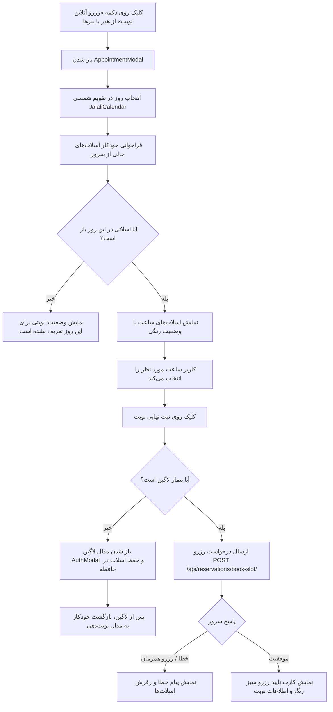

# سند طراحی محصول (PRD) — فرآیند رزرو نوبت آنلاین مراجعین
## Product Requirement Document: Patient Appointment Booking Modal Flow

---

### ۱. مشخصات سند (Document Metadata)
- **شناسه سند:** `PRD-FE-004`
- **ماژول:** نوبت‌دهی آنلاین و رزرو ویزیت (Appointment Booking)
- **وضعیت پیاده‌سازی:** ✅ پیاده‌سازی کامل (Completed)
- **کامپوننت‌های فرانت‌اند:**
  - مودال جامع رزرو: [`src/components/ui/AppointmentModal.jsx`](file:///e:/GitHub%20Repo/kamelion/front-end/src/components/ui/AppointmentModal.jsx)
  - تقویم شمسی اختصاصی: [`src/components/ui/JalaliCalendar.jsx`](file:///e:/GitHub%20Repo/kamelion/front-end/src/components/ui/JalaliCalendar.jsx)
  - دکمه‌های اسلات زمان: [`src/components/SlotButton.jsx`](file:///e:/GitHub%20Repo/kamelion/front-end/src/components/SlotButton.jsx)
- **سرویس‌ها و کاربردها:**
  - سرویس رزرواسیون: [`src/api/reservationService.js`](file:///e:/GitHub%20Repo/kamelion/front-end/src/api/reservationService.js)
  - ابزارهای تاریخ جلالی: [`src/utils/jalaliDateUtils.js`](file:///e:/GitHub%20Repo/kamelion/front-end/src/utils/jalaliDateUtils.js)

---

### ۲. هدف و ارزش بیزینسی (Product Vision & Goals)
- **بیان مسئله:** تماس‌های تلفنی مکرر برای استعلام زمان خالی پزشک باعث اشغال خطوط کلینیک، اتلاف وقت منشی و خستگی بیماران در ساعات غیرکاری می‌شود.
- **ارزش بیزینسی:** سیستم نوبت‌دهی آنلاین ۲۴ ساعته امکان انتخاب دقیق تاریخ و ساعت ویزیت را با اتصال زنده به دیتابیس شیفت‌های کلینیک فراهم می‌آورد.
- **اهداف کلیدی:**
  - صفر کردن خطاهای تداخل نوبت (Double-booking).
  - فراهم‌سازی تجربه رزرو در کمتر از ۱ دقیقه با پشتیبانی کامل از تاریخ هجری شمسی.
  - پیوند یکپارچه با سیستم احراز هویت بدون از دست رفتن داده‌های انتخابی بیمار.

---

### ۳. پرسوناها و ذی‌نفعان (Target Personas)
- **بیماران نیازمند مشاوره جراحی پستان:** مایلند زمان مناسب را در روزهای کاری پزشک (شنبه تا پنج‌شنبه) انتخاب و نوبت خود را قطعی کنند.
- **منشی کلینیک:** نوبت‌ها مستقیماً وارد کارتابل ادمین شده و نیاز به ثبت دستی به حداقل می‌رسد.
- **پزشک متخصص:** ظرفیت ویزیت کنترل شده و از ازدحام خارج از شیفت جلوگیری می‌شود.

---

### ۴. جریان تعاملی کاربر (User Booking Journey)



---

### ۵. الزامات عملکردی (Functional Requirements)
1. **سازگاری با تقویم شمسی:**
   - نمایش ماه‌های شمسی (فروردین تا اسفند)، نام روزهای هفته از شنبه تا جمعه.
   - تاریخ ارسالی به وب‌سرویس به صورت فرمت استاندارد میلادی `YYYY-MM-DD` تبدیل می‌شود (`formatDateForApi`).
2. **استعلام برخط ظرفیت (Live Slot Fetching):**
   - به محض کلیک کاربر روی هر روز، درخواست `GET /api/reservations/available-slots/?date=YYYY-MM-DD` به سرور ارسال می‌شود.
3. **دریچه ورود (Authentication Gate):**
   - کاربر مهمان می‌تواند تا مرحله انتخاب اسلات پیش برود، اما برای ثبت قطعی نوبت باید شماره خود را تایید کرده باشد.
   - وضعیت انتخاب‌شده در استیت حفظ می‌شود تا پس از اتمام احراز هویت، نیازی به انتخاب مجدد تاریخ و ساعت نباشد.
4. **تاییدیه و رسید نوبت:**
   - پس از رزرو موفق، وضعیت موفقیت‌آمیز (`isConfirmed`) با جزئیات تاریخ شمسی، ساعت ویزیت و راهنمای حضور در کلینیک نمایش داده می‌شود.

---

### ۶. مشخصات رابط کاربری و تجربه کاربری (UI/UX)
- **طراحی مدال:** گلس‌مورفیک ریسپانسیو، با قابلیت بستن با دکمه ضربدر یا کلیک در فضای خالی.
- **طراحی اسلات‌ها:**
  - سبز روشن: اسلات آزاد و قابل رزرو (`available`).
  - خاکستری با خط تیره: اسلات رزرو شده یا غیرفعال (`reserved`).
  - زرد/نارنجی ملایم: اسلات در انتظار تایید (`pending`).
- **حالات لودینگ:** اسکلتون و آیکون چرخشی `Loader2` هنگام بارگذاری اسلات‌های روز انتخابی.

---

### ۷. قراردادهای وب سرویس (API Contracts)
- **دریافت اسلات‌های خالی:**
  - `GET /api/reservations/available-slots/?date=2026-10-15`
  - Response:
    ```json
    {
      "date": "2026-10-15",
      "available_slots": [
        { "time": "16:00", "status": "available" },
        { "time": "16:30", "status": "reserved" },
        { "time": "17:00", "status": "available" }
      ]
    }
    ```
- **ثبت رزرو نهایی نوبت:**
  - `POST /api/reservations/book-slot/`
  - Headers: `Authorization: Bearer <access_token>`
  - Payload:
    ```json
    {
      "date": "2026-10-15",
      "time": "16:00",
      "notes": "مشاوره جراحی آنکوپلاستی"
    }
    ```

---

### ۸. وابستگی‌ها و عدم رگرسیون (Invariants)
- **هماهنگی نام فیلدهای اسلات:** متد `normalizeSlotsResponse` اسلات‌ها را هم با ساختار آبجکت `{ time, status }` و هم با آرایه رشته‌ای ساده `['16:00', '16:30']` پشتیبانی می‌کند؛ این قابلیت نباید حذف شود تا بک‌اند در صورت تغییر نسخه دچار کرش نشود.
- **تداخل تقویم و شیفت‌های هفتگی:** در صورت تعریف استثناء یا تعطیلی توسط ادمین در بک‌اند، اسلات‌های آن روز خالی برمی‌گردند و مدال پیام «عدم حضور پزشک» را نمایش می‌دهد.

---

### ۹. حالات مرزی و مدیریت خطا (Edge Cases)
- **رزرو همزمان (Race Condition):** اگر دو کاربر همزمان یک اسلات را باز کنند و نفر اول آن را رزرو کند، کاربر دوم با خطای ۴۰۰ مواجه شده و لیست اسلات‌ها فوراً رفرش می‌شود.
- **قطع ارتباط شبکه:** نمایش دکمه «تلاش مجدد» بدون نیاز به بستن مدال.
