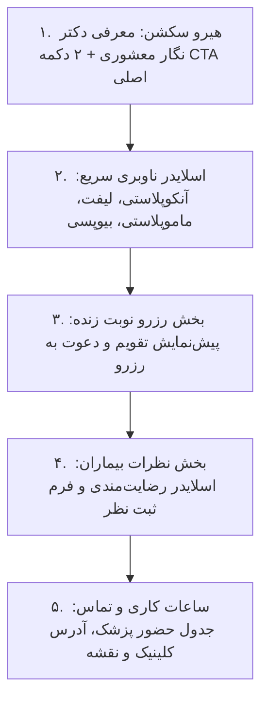

# سند طراحی محصول (PRD) — صفحه اصلی و لندینگ پیج کلینیک
## Product Requirement Document: Landing & Home Page Experience

---

### ۱. مشخصات سند (Document Metadata)
- **شناسه سند:** `PRD-FE-006`
- **ماژول:** تجربه کاربری عمومی و لندینگ پیج (Public Landing Experience)
- **وضعیت پیاده‌سازی:** ✅ پیاده‌سازی کامل (Completed)
- **کامپوننت‌های فرانت‌اند:**
  - صفحه اصلی: [`src/pages/HomePage.jsx`](file:///e:/GitHub%20Repo/kamelion/front-end/src/pages/HomePage.jsx)
  - بخش هیرو و ارزش پیشنهادی: [`src/components/sections/HeroSection.jsx`](file:///e:/GitHub%20Repo/kamelion/front-end/src/components/sections/HeroSection.jsx)
  - اسلایدر ناوبری سریع خدمات: [`src/components/sections/QuickNavSlider.jsx`](file:///e:/GitHub%20Repo/kamelion/front-end/src/components/sections/QuickNavSlider.jsx)
  - بخش رزرو سریع: [`src/components/sections/BookingSection.jsx`](file:///e:/GitHub%20Repo/kamelion/front-end/src/components/sections/BookingSection.jsx)
  - بخش نظرات مراجعین: [`src/components/sections/ReviewsSection.jsx`](file:///e:/GitHub%20Repo/kamelion/front-end/src/components/sections/ReviewsSection.jsx)
  - ساعات کاری و تماس: [`src/components/sections/ContactHoursSection.jsx`](file:///e:/GitHub%20Repo/kamelion/front-end/src/components/sections/ContactHoursSection.jsx)

---

### ۲. هدف و ارزش بیزینسی (Product Vision & Goals)
- **بیان مسئله:** صفحه اصلی اولین نقطه تماس بیماران مبتلا به عوارض پستان یا متقاضیان جراحی زیبایی با پزشک است. نبود اعتماد اولیه، ابهام در صلاحیت‌های علمی یا پیچیدگی در ثبت نوبت باعث خروج فوری کاربر می‌شود.
- **ارزش بیزینسی:** ارائه لندینگ پیج یکپارچه با هویت علمی و پزشکی، نرخ تعامل و ثبت نوبت را به حداکثر رسانده و حس اطمینان، امید و آرامش خاطر را القا می‌کند.
- **اهداف کلیدی:**
  - معرفی سریع فوق‌تخصص و تخصص‌های اصلی دکتر نگار معشوری در بالای صفحه (Above the Fold).
  - ارائه ۲ مسیر فوری به مراجع: «رزرو نوبت حضوری» و «تریاژ آنلاین علائم».
  - فراهم‌سازی دسترسی تک‌کلیکی به شاخه‌های درمانی از طریق اسلایدر تعاملی.

---

### ۳. ساختار و سکشن‌های صفحه اصلی (Landing Sections)

---

### ۴. الزامات عملکردی بخش‌ها (Functional Requirements)
1. **هیرو سکشن (`HeroSection`):**
   - تیتر اصلی برند، مدال بورد تخصصی جراحی و فلوشیپ پستان.
   - دو دکمه CTA محوری: دکمه طلایی رزرو نوبت (`onOpenAppointment`) و دکمه تریاژ هوشمند (`onOpenChat`).
   - بج‌های ارزش کلینیک: «تشخیص زودهنگام»، «جراحی انکوپلاستی محافظت‌کننده»، «تجهیزات نوین».
2. **اسلایدر ناوبری سریع (`QuickNavSlider`):**
   - کارت‌های تعاملی با افکت هاور گلس‌مورفیک برای مرور خدمات کلیدی کلینیک.
   - لینک مستقیم به صفحات جزئیات خدمات یا فیلترهای مرتبط.
3. **بخش نوبت‌دهی توکار (`BookingSection`):**
   - کارت بصری ترغیب‌کننده رزرو نوبت با نمایش روزهای فعال کلینیک جهت جلوگیری از ترک صفحه.
4. **ساعات کاری و اطلاعات تماس (`ContactHoursSection`):**
   - روزهای شنبه تا چهارشنبه: ساعت ۱۶:۰۰ الی ۲۰:۰۰ (پاسخگویی تلفنی و ویزیت حضوری).
   - پنج‌شنبه‌ها: ساعت ۱۰:۰۰ الی ۱۴:۰۰ (مشاوره‌ها و پانسمان).
   - جمعه‌ها: تعطیل رسمی مطب.
   - آدرس دقیق کلینیک و شماره تماس مستقیم با قابلیت کلیک جهت تماس تلفنی (`tel:`).

---

### ۵. مشخصات رابط کاربری و انیمیشن‌ها (UI/UX)
- استفاده از هوک `useScrollFade` برای محو شدن و پدیدار شدن تدریجی کارت‌ها با اسکرول کاربر.
- رنگ‌بندی داینامیک متصل به سیستم تم (`--primary`, `--bg-light`, `--bg-dark`).
- بهینه‌سازی ۱۰۰٪ برای ابعاد مختلف تلفن همراه (بدون سرریز افقی یا لرزش صفحه).

---

### ۶. وابستگی‌ها و عدم رگرسیون (Invariants)
- **پراپ‌های متصل به مودال:** کامپوننت `HomePage` حتماً باید توابع `onOpenAppointment` و `onOpenChat` را از ریشه دریافت و به سکشن‌های فرزند پاس دهد.
- عدم شکستن تگ‌های سئو و متادیتاهای اصلی سایت.
