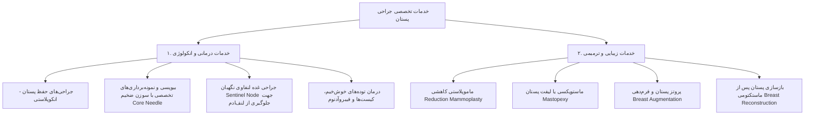

# سند طراحی محصول (PRD) — خدمات درمانی، انکولوژی و زیبایی پستان
## Product Requirement Document: Medical & Aesthetic Services Page

---

### ۱. مشخصات سند (Document Metadata)
- **شناسه سند:** `PRD-FE-007`
- **ماژول:** پرتال خدمات تخصصی پزشکی (Medical Services Catalog)
- **وضعیت پیاده‌سازی:** ✅ پیاده‌سازی کامل (Completed)
- **کامپوننت‌های فرانت‌اند:**
  - صفحه خدمات: [`src/pages/ServicesPage.jsx`](file:///e:/GitHub%20Repo/kamelion/front-end/src/pages/ServicesPage.jsx)
  - بخش معرفی خدمات در صفحه اصلی: [`src/components/sections/ServicesSection.jsx`](file:///e:/GitHub%20Repo/kamelion/front-end/src/components/sections/ServicesSection.jsx)

---

### ۲. هدف و ارزش بیزینسی (Product Vision & Goals)
- **بیان مسئله:** بیماران نیازمند تفکیک دقیق بین خدمات درمانی و انکولوژی (سرطان، توده‌ها، بیوپسی) و خدمات زیبایی و ترمیمی (لیفت، پروتز، ماموپلاستی) هستند تا تخصص پزشک و دامنه خدمات کلینیک را کاملاً شفاف درک کنند.
- **ارزش بیزینسی:** ارائه فهرست جامع و با جزئیات علمی از خدمات جراحی باعث افزایش آگاهی بیمار، اعتمادسازی و هدایت مستقیم به رزرو نوبت مرتبط می‌شود.
- **اهداف کلیدی:**
  - دسته‌بندی دوسطحی خدمات: ۱. درمان و انکولوژی | ۲. جراحی‌های زیبایی و ترمیمی.
  - نمایش مزایای جراحی توسط جراح فوق‌تخصص پستان در مقایسه با جراحی‌های عمومی.
  - تعبیه دکمه رزرو نوبت اختصاصی در انتهای صفحه خدمات.

---

### ۳. ساختار دسته‌بندی خدمات (Services Breakdown)

---

### ۴. الزامات عملکردی (Functional Requirements)
1. **دسته‌بندی شفاف:** هر خدمت دارای عنوان علمی، نام مصطلح، توضیحات مزایا و آیکون شناختی مرتبط است.
2. **اتصال به نوبت‌دهی:** در بخش انتهایی صفحه، بنر CTA متصل به تابع `onOpenAppointment` تعبیه شده تا کاربر بلافاصله پس از مطالعه خدمات بتواند رزرو نوبت را آغاز کند.
3. **انکر لینک‌ها (Anchor Links):** امکان ارجاع مستقیم کاربر از سایر بخش‌ها (مانند فوتر یا هیرو) به بخش انکولوژی (`#treatment`) یا زیبایی (`#aesthetic`).

---

### ۵. مشخصات رابط کاربری و تجربه کاربری (UI/UX)
- شبکه ۲ ستونه کارت‌های شیشه‌ای (`bg-white/60 backdrop-blur-md`) با هاور افکت‌های رنگی هماهنگ با تم جاری.
- آیکون‌های متناسب از کتابخانه `lucide-react` شامل `Activity`, `Sparkles`, `Shield`, `HeartPulse`.
- تایپوگرافی منظم و خوانا با فواصل مناسب پاراگراف‌ها جهت کاهش خستگی چشم بیمار.

---

### ۶. وابستگی‌ها و عدم رگرسیون (Invariants)
- **پراپ `onOpenAppointment`:** این صفحه باید پراپ هندلر باز شدن مدال نوبت را به صورت ایمن دریافت کند.
- متون علمی و توضیحات پزشکی مطابق با استانداردهای نظام پزشکی و پروتکل‌های رسمی دکتر نگار معشوری باقی بماند.
