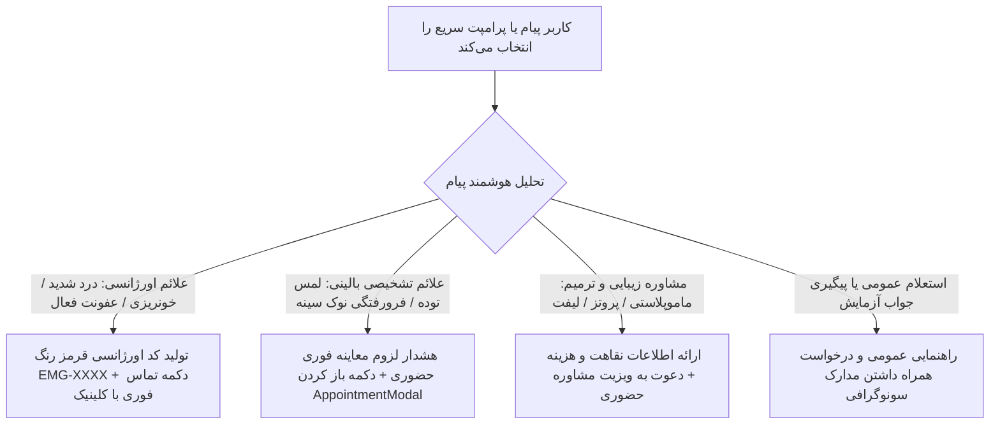

# سند طراحی محصول (PRD) — ویجت شناور تریاژ هوشمند بالینی
## Product Requirement Document: AI Smart Triage Floating Widget & Chat Capsule

---

### ۱. مشخصات سند (Document Metadata)
- **شناسه سند:** `PRD-FE-011`
- **ماژول:** تریاژ هوشمند و مشاوره ترغیبی (Clinical AI Triage)
- **وضعیت پیاده‌سازی:** 🟡 پیاده‌سازی تعاملی در کلاینت (در انتظار اتصال کامل به FastAPI `chat_gateway`)
- **کامپوننت‌های فرانت‌اند:**
  - کپسول شناور و پنجره چت: [`src/components/chat/FloatingChatWidget.jsx`](file:///e:/GitHub%20Repo/kamelion/front-end/src/components/chat/FloatingChatWidget.jsx)
  - اجزای فرعی چت: [`src/components/chat/ChatContainer.jsx`](file:///e:/GitHub%20Repo/kamelion/front-end/src/components/chat/ChatContainer.jsx), [`ChatMessages.jsx`](file:///e:/GitHub%20Repo/kamelion/front-end/src/components/chat/ChatMessages.jsx), [`ChatSuggestions.jsx`](file:///e:/GitHub%20Repo/kamelion/front-end/src/components/chat/ChatSuggestions.jsx)
  - سناریوهای آماده تریاژ: [`src/data/chatScenarios.js`](file:///e:/GitHub%20Repo/kamelion/front-end/src/data/chatScenarios.js)
  - سرویس چت: [`src/api/chatService.js`](file:///e:/GitHub%20Repo/kamelion/front-end/src/api/chatService.js)
  - هوک‌های اختصاصی: [`src/hooks/useBodyScrollLock.js`](file:///e:/GitHub%20Repo/kamelion/front-end/src/hooks/useBodyScrollLock.js), [`src/hooks/useFooterOverlap.js`](file:///e:/GitHub%20Repo/kamelion/front-end/src/hooks/useFooterOverlap.js)

---

### ۲. هدف و ارزش بیزینسی (Product Vision & Goals)
- **بیان مسئله:** بیمارانی که با علائم نگران‌کننده (مانند لمس توده، درد تیز یا خونریزی) وارد سایت می‌شوند، نیازمند ارزیابی فوری سطح فوریت بالینی هستند؛ ندانستن سطح خطر موجب استرس یا بی‌توجهی خطرناک به بیماری می‌شود.
- **ارزش بیزینسی:** تریاژ آنلاین علائم بیمار را در لحظه دسته‌بندی کرده، برای موارد اورژانسی کد ارجاع سریع صادر می‌کند و برای سایر موارد، بیمار را مستقیماً به رزرو نوبت مرتبط با پزشک هدایت می‌نماید.
- **اهداف کلیدی:**
  - تشخیص کلمات کلیدی پرخطر و صدور کد اورژانسی (`EMG-XXXX`) همراه با امکان تماس تلفنی مستقیم با یک کلیک.
  - تعامل صمیمی از طریق کپسول شناور با متن‌های چرخان (Rotating Placeholders) در پایین مرکز صفحه.
  - تبدیل گفتگوی چت به نوبت قطعی از طریق دکمه درون‌متنی «رزرو نوبت حضوری».

---

### ۳. سطوح تریاژ و سناریوهای تصمیم‌گیری (Triage Decision Trees)

---

### ۴. الزامات عملکردی (Functional Requirements)
1. **کپسول شناور پایین صفحه (Bottom Floating Pill):**
   - در پایین مرکز تمام صفحات عمومی سایت قرار دارد (`fixed bottom-6 left-1/2 -translate-x-1/2`).
   - دارای متن متغیر انیمیشنی هر ۳ ثانیه یک‌بار جهت جلب توجه ملایم کاربر بدون ایجاد مزاحمت.
   - ورودی متن سریع و دکمه ارسال با آیکون روبات `Bot`.
   - **تغییر هوشمند به دکمه گوشه بالای فوتر (Smart Lift above Footer):** با نزدیک شدن اسکرول کاربر به انتهای سایت و ورود `#site-footer` به صفحه، کپسول عریض به یک FAB جمع‌وجور با آیکون جرقه و نشانگر آنلاین در گوشه پایین چپ تغییر شکل می‌دهد و با هوک `useFooterOverlap` به صورت داینامیک دقیقاً ۲۴ پیکسل بالاتر از لبه بالایی فوتر قرار می‌گیرد تا هیچ بخشی از متن یا پیوندهای فوتر پوشانده نشود.
2. **پنجره چت گلس‌مورفیک (Expanded Chat Window):**
   - با کلیک روی کپسول، پنجره گفتگو با افکت اسلاید باز می‌شود و اسکرول صفحه پس‌زمینه با `useBodyScrollLock` قفل می‌گردد.
   - ریسپانسیو کامل در موبایل با ارتفاع داینامیک ویوپورت (`100dvh`) و رعایت حاشیه امن (`safe-area-inset-bottom`).
   - اسکرول کاملاً ایزوله در سطح کانتینر چت بدون پرش صفحه پس‌زمینه، همراه با تشخیص اسکرول کاربر (جلوگیری از پرش اجباری در صورت اسکرول به بالا برای مطالعه پیام‌های پیشین).
3. **پرامپت‌های پیشنهادی سریع (Quick Prompts):**
   - «درد یا خونریزی شدید دارم» (با آیکون هشدار و وضعیت Urgent).
   - «توده جدید در سینه لمس کرده‌ام».
   - «مشاوره جراحی ماموپلاستی و زیبایی».
   - «بررسی جواب ماموگرافی و سونوگرافی».
   - «رزرو نوبت ویزیت با پزشک» (مستقیماً `onOpenAppointment` را صدا می‌زند).
4. **تولید کد بحرانی (Emergency Code):**
   - تولید کد یکتا مثل `EMG-8421` برای بیماران اورژانسی جهت ارائه مستقیم به منشی یا اورژانس کلینیک با دکمه کپی کد در کلیپ‌بورد.

---

### ۵. مشخصات رابط کاربری و تجربه کاربری (UI/UX)
- حباب‌های گفتگوی تمایزیافته: حباب‌های کاربر (گرادیانت رنگ اصلی کلینیک) و حباب‌های روبات هوشمند (سفید نیمه‌شفاف با سایه ملایم).
- نشانگر تایپ سه‌نقطه‌ای انیمیشنی (`isTyping`) هنگام پردازش پاسخ.
- کارت‌های اقدام درون‌متنی (Interactive Action Cards) شامل دکمه بنفش رزرو نوبت و دکمه قرمز تماس اضطراری.

---

### ۶. وضعیت فعلی و نیازمندی اتصال بک‌اند (Current Status & Gap)
- **وضعیت کلاینت:** ۱۰۰٪ تعاملی، با سناریوهای لوکال و تصمیم‌گیری مبتنی بر کلمات کلیدی بالینی کار می‌کند.
- **شکاف توسعه (Backend Gap):** ماژول فرانت هم‌اکنون به سرور هوش مصنوعی لاگین نمی‌شود؛ پس از تکمیل سرویس `chat_gateway` در FastAPI، متد `chatService.sendMessage` با قابلیت پاسخ جریانی (Streaming LLM Response) و ذخیره پروفایل تریاژ در پرونده ادمین فعال خواهد شد.
