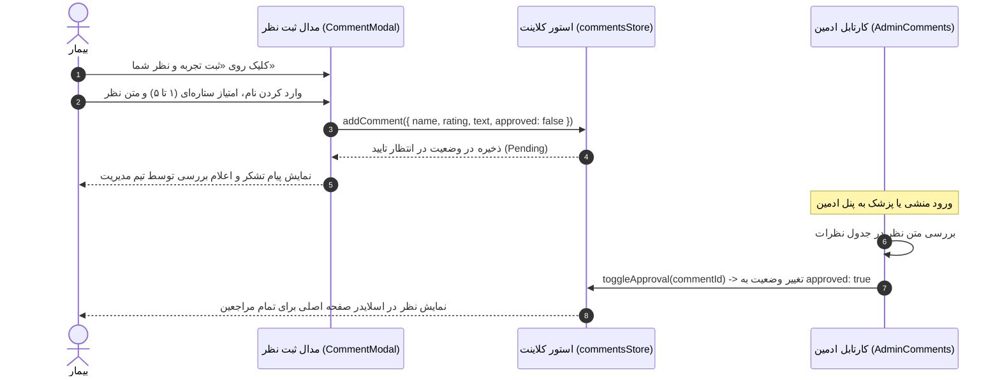

# سند طراحی محصول (PRD) — نظرات، تجربیات و رضایت‌سنجی بیماران
## Product Requirement Document: Patient Reviews & Testimonials Submission

---

### ۱. مشخصات سند (Document Metadata)
- **شناسه سند:** `PRD-FE-012`
- **ماژول:** تعامل و بازخورد بیماران (Patient Social Proof & Reviews)
- **وضعیت پیاده‌سازی:** 🟡 پیاده‌سازی کامل رابط کاربری با ذخیره‌سازی محلی (نیازمند اتصال اندپوینت دیتابیس)
- **کامپوننت‌های فرانت‌اند:**
  - سکشن نظرات در صفحه اصلی: [`src/components/sections/ReviewsSection.jsx`](file:///e:/GitHub%20Repo/kamelion/front-end/src/components/sections/ReviewsSection.jsx)
  - مدال ثبت و مرور نظرات: [`src/components/CommentModal.jsx`](file:///e:/GitHub%20Repo/kamelion/front-end/src/components/CommentModal.jsx)
  - پنل مدیریت و تایید ادمین: [`src/pages/admin/AdminComments.jsx`](file:///e:/GitHub%20Repo/kamelion/front-end/src/pages/admin/AdminComments.jsx)
- **استور و سرویس:**
  - استور نظرات: [`src/store/commentsStore.js`](file:///e:/GitHub%20Repo/kamelion/front-end/src/store/commentsStore.js)
  - سرویس ارتباطی: [`src/api/reviewsService.js`](file:///e:/GitHub%20Repo/kamelion/front-end/src/api/reviewsService.js)

---

### ۲. هدف و ارزش بیزینسی (Product Vision & Goals)
- **بیان مسئله:** در حوزه درمان‌های انکولوژی و جراحی پستان، هیچ عاملی به اندازه شنیدن تجربیات واقعی سایر بانوانی که این مسیر را با موفقیت طی کرده‌اند، به بیمار جدید آرامش و امید نمی‌دهد.
- **ارزش بیزینسی:** اثبات اجتماعی (Social Proof) مبتنی بر نظرات واقعی، رضایت‌مندی کلی مراجعین را به نمایش گذاشته و انگیزه مراجعه و پیگیری درمان را به طرز چشمگیری بالا می‌برد.
- **اهداف کلیدی:**
  - نمایش میانگین امتیاز کلینیک (۴.۹ از ۵) و نظرات تاییدشده بیماران در صفحه اصلی.
  - فراهم‌سازی فرم ثبت نظر آسان همراه با امتیاز ستاره‌ای (۱ تا ۵ ستاره).
  - خط لوله نظارت (Moderation Pipeline): جلوگیری از انتشار عمومی نظرات پیش از تایید ادمین.

---

### ۳. چرخه حیات یک نظر (Review Lifecycle)

---

### ۴. الزامات عملکردی (Functional Requirements)
1. **اسلایدر نظرات برتر در لندینگ:**
   - نمایش خودکار کارت‌های نظرات تاییدشده (`approved: true`).
   - نمایش آواتار حروف اول نام، تاریخ شمسی، ستاره‌های طلایی و متن دیدگاه.
2. **مدال مرور تمام نظرات (Browse All Reviews):**
   - قابلیت جستجوی متنی در کلمات داخل نظرات.
   - فیلتر بر اساس ستاره (۵ ستاره، ۴ ستاره و ...).
3. **فرم ارسال دیدگاه جدید:**
   - انتخاب امتیاز ستاره‌ای با انیمیشن تعاملی کلیک و هاور.
   - فیلد نام مراجع و جعبه متن پیام با اعتبارسنجی حداقل کاراکتر.
4. **خط‌مشی نظارت و پایش (Moderation Policy):**
   - هیچ دیدگاهی به صورت خودکار بدون تایید منشی یا پزشک به نمایش عمومی درنمی‌آید تا از الفاظ نامناسب یا اطلاعات حساس پزشکی جلوگیری شود.

---

### ۵. وضعیت فعلی و نیازمندی اتصال بک‌اند (Current Gap)
- هم‌اکنون استور `commentsStore` داده‌ها را در `localStorage` کلاینت ذخیره و سینک می‌کند.
- برای انتشار همگانی دیدگاه‌ها روی دستگاه‌های مراجعین مختلف، نیازمند ذخیره‌سازی در مدل `Review` در دیتابیس جنگو و اتصال به اندپوینت‌های `GET /api/reviews/` و `POST /api/reviews/` و `PATCH /api/admin/reviews/:id/` هستیم.
